## Failure Scenario Analysis

### Single Node Failures

#### Primary Process Crash

**Scenario**: PostgreSQL primary process is `kill -9` or crashes


#### Patroni Process Failure

**Scenario**: Patroni process is killed or crashes

```mermaid
flowchart TB
    FAULT["Patroni process failure"]

    subgraph Detection["Failure Detection"]
        D1["Patroni stops lease renewal"]
        D2["PostgreSQL continues running<br/>(orphan state)"]
        D3["Etcd lease countdown"]
    end

    subgraph FailsafeOn["failsafe_mode: true"]
        FS1["Check if can access other Patroni"]
        FS2["✅ Can → Continue as primary"]
        FS3["❌ Cannot → Self-demote"]
    end

    subgraph FailsafeOff["failsafe_mode: false"]
        FF1["Trigger switchover after lease expires"]
        FF2["Original primary demotes"]
    end

    FAULT --> Detection
    Detection --> FailsafeOn
    Detection --> FailsafeOff

    style FAULT fill:#f44336,color:#fff
    style FS2 fill:#4CAF50,color:#fff
    style FS3 fill:#ff9800,color:#fff
```



#### Replica Failure

**Scenario**: Any replica node fails

**Impact**:
- Read-only traffic redistributed to other replicas
- If no other replicas, primary handles read-only traffic
- ✅ Write service completely unaffected

**Recovery**:
- Node recovery triggers Patroni auto-start
- Auto-resync from primary
- Restored as replica role

-----------------

### Multi-Node Failures

#### Three Nodes Down to Two (2/3 Failure)

**Scenario**: 3-node cluster, 2 nodes fail simultaneously


**Emergency Recovery Procedure**:

```bash
# 1. Confirm surviving node status
patronictl -c /etc/patroni/patroni.yml list

# 2. If surviving node is replica, manually promote
pg_ctl promote -D /pg/data

# 3. Or use pg-promote script
/pg/bin/pg-promote

# 4. Modify HAProxy config, point directly to surviving node
# Comment out health checks, hardcode routing

# 5. After recovering Etcd cluster, reinitialize
```

#### Two Nodes Down to One (1/2 Failure)

**Scenario**: 2-node cluster, primary fails

**Problem**:
- Etcd has only 2 nodes, no majority
- Cannot complete election
- Replica cannot auto-promote

**Solutions**:
1. Option 1: Add external Etcd arbiter node
2. Option 2: Manual intervention to promote replica
3. Option 3: Use Witness node

**Manual Promotion Steps**:
1. Confirm primary is truly unrecoverable
2. Stop replica Patroni: `systemctl stop patroni`
3. Manual promote: `pg_ctl promote -D /pg/data`
4. Start PostgreSQL directly: `systemctl start postgres`
5. Update application connection strings or HAProxy config

-----------------

### Etcd Cluster Failures

#### Etcd Single Node Failure

**Scenario**: 3-node Etcd cluster, 1 node fails

**Impact**:
- ✅ Etcd still has majority (2/3)
- ✅ Service runs normally
- ✅ PostgreSQL HA unaffected

**Recovery**:
- Fix failed node
- Use etcd-add to rejoin
- Or replace with new node

#### Etcd Majority Lost

**Scenario**: 3-node Etcd cluster, 2 nodes fail

```mermaid
flowchart TB
    subgraph Impact["❌ Impact"]
        I1["Etcd cannot write"]
        I2["Patroni cannot renew lease"]
        I3["failsafe_mode activates"]
        I4["Cannot perform failover"]
    end

    subgraph PG["PostgreSQL Behavior"]
        P1["🟢 Primary: Continues running"]
        P2["🔵 Replica: Continues replicating"]
        P3["✅ New writes can continue"]
    end

    subgraph Limit["⚠️ Limitations"]
        L1["Cannot switchover"]
        L2["Cannot failover"]
        L3["Config changes cannot take effect"]
    end

    Impact --> PG --> Limit

    style I1 fill:#ffcdd2
    style P1 fill:#c8e6c9
    style L1 fill:#fff9c4
```



**Recovery Priority**:
1. Restore Etcd majority
2. Verify PostgreSQL status
3. Check Patroni lease renewal

-----------------

### Network Partition

#### Primary Network Isolation

**Scenario**: Primary cannot reach Etcd/other nodes

```mermaid
flowchart LR
    subgraph Isolated["🔒 Isolated Side (Primary)"]
        P1["Primary"]
        CHECK{"failsafe_mode<br/>check"}
        CONT["Continue running"]
        DEMOTE["Self-demote"]

        P1 --> CHECK
        CHECK -->|"Can access other Patroni"| CONT
        CHECK -->|"Cannot access"| DEMOTE
    end

    subgraph Majority["✅ Majority Side"]
        E[("Etcd")]
        P2["Replica"]
        ELECT["Trigger election"]
        NEWPRI["New primary emerges"]

        E --> ELECT --> P2 --> NEWPRI
    end

    Isolated -.->|"Network partition"| Majority

    style P1 fill:#ff9800,color:#fff
    style DEMOTE fill:#f44336,color:#fff
    style NEWPRI fill:#4CAF50,color:#fff
```



**Split-brain Protection**:
- Patroni failsafe_mode
- Old primary self-detection
- Fencing (optional)
- Watchdog (optional)

#### Watchdog Mechanism

**For protection in extreme scenarios**:

```yaml
watchdog:
  mode: automatic                     # off|automatic|required
  device: /dev/watchdog
  safety_margin: 5                    # Safety margin (seconds)
```

**How it works**:
- Patroni periodically writes to watchdog device
- If Patroni unresponsive, kernel triggers restart
- Ensures old primary doesn't continue serving
- Prevents severe split-brain scenarios

-----------------

## Best Practices

### Production Environment Checklist

**Infrastructure**:
- [ ] At least 3 nodes (PostgreSQL)
- [ ] At least 3 nodes (Etcd, can share with PG)
- [ ] Nodes distributed across different failure domains (racks/AZs)
- [ ] Network latency < 10ms (same city) or < 50ms (cross-region)
- [ ] 10GbE network (recommended)

**Parameter Configuration**:
- [ ] `pg_rto` adjusted based on network conditions (15-60s)
- [ ] `pg_rpo` set based on business requirements (0 or 1MB)
- [ ] `pg_conf` choose appropriate template (oltp/crit)
- [ ] `patroni_watchdog_mode` evaluate necessity

**Monitoring Alerts**:
- [ ] Patroni status monitoring (leader/replication lag)
- [ ] Etcd cluster health monitoring
- [ ] Replication lag alerts (lag > 1MB)
- [ ] failsafe_mode activation alerts

**Disaster Recovery Drills**:
- [ ] Regularly execute failover drills
- [ ] Verify RTO/RPO meets expectations
- [ ] Test backup recovery procedures
- [ ] Verify monitoring alert effectiveness

### Common Troubleshooting

**Failover Failures**:
```bash
# Check Patroni status
patronictl -c /etc/patroni/patroni.yml list

# Check Etcd cluster health
etcdctl endpoint health

# Check replication lag
psql -c "SELECT * FROM pg_stat_replication"

# View Patroni logs
journalctl -u patroni -f
```

**Split-brain Handling**:
```bash
# 1. Confirm which is the "true" primary
psql -c "SELECT pg_is_in_recovery()"

# 2. Stop the "wrong" primary
systemctl stop patroni

# 3. Use pg_rewind to sync
pg_rewind --target-pgdata=/pg/data --source-server="host=<true_primary>"

# 4. Restart Patroni
systemctl start patroni
```


