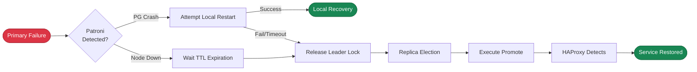

Patroni failures can be classified into 10 categories by failure target, and further consolidated into five categories based on detection path, which are detailed in this section.

| #  | Failure Scenario              | Description                            | Final Path                           |
|----|-------------------------------|----------------------------------------|--------------------------------------|
| 1  | PG process crash              | crash, OOM killed                      | **Active Detection**                 |
| 2  | PG connection refused         | max_connections                        | **Active Detection**                 |
| 3  | PG zombie                     | Process alive but unresponsive         | **Active Detection** (timeout)       |
| 4  | Patroni process crash         | kill -9, OOM                           | **Passive Detection**                |
| 5  | Patroni zombie                | Process alive but stuck                | **Watchdog**                         |
| 6  | Node down                     | Power outage, hardware failure         | **Passive Detection**                |
| 7  | Node zombie                   | IO hang, CPU starvation                | **Watchdog**                         |
| 8  | Primary ↔ DCS network failure | Firewall, switch failure               | **Network Partition**                |
| 9  | Storage failure               | Disk failure, disk full, mount failure | **Active Detection** or **Watchdog** |
| 10 | Manual switchover             | Switchover/Failover                    | **Manual Trigger**                   |
{.full-width}

However, for RTO calculation purposes, all failures ultimately converge to two paths. This section explores the upper bound, lower bound, and average RTO for these two scenarios.

- [**Passive election triggered after Patroni loses contact**](/docs/concept/ha/failure/passive)
- [**Patroni actively detects failure and triggers switchover**](/docs/concept/ha/failure/active)

