Pigsty's PostgreSQL clusters come with out-of-the-box high availability, powered by [**Patroni**](https://patroni.readthedocs.io/en/latest/), [**Etcd**](https://etcd.io/), and [**HAProxy**](http://www.haproxy.org/).

When your PostgreSQL cluster has two or more instances, you automatically have self-healing database high availability without any additional configuration — as long as any instance survives, the cluster can provide complete service. Clients only need to connect to any node to get full service without worrying about primary-replica topology changes.

With default configuration, the primary failure Recovery Time Objective (RTO) ≈ 30s, and Recovery Point Objective (RPO) < 1MB; for replica failures, RPO = 0 and RTO ≈ 0 (brief interruption). In consistency-first mode, failover can guarantee zero data loss: RPO = 0. All metrics can be [**configured as needed**](#tradeoffs) based on your hardware conditions and reliability requirements.

Pigsty includes built-in HAProxy load balancers for automatic traffic switching, providing DNS/VIP/LVS and other access methods. Failover and switchover are almost transparent to business except for brief interruptions - applications don't need to modify connection strings or restart.
Minimal maintenance window requirements bring great flexibility: you can perform rolling maintenance on the entire cluster without application coordination. Hardware failures can wait until the next day to handle, letting developers, operations, and DBAs sleep well during incidents.

Many large organizations have been using Pigsty in production for extended periods. The largest deployment has 25K CPU cores and 220+ PostgreSQL ultra-large instances (64c / 512g / 3TB NVMe SSD). Over five years with dozens of hardware failures, overall availability of over **99.999%** was maintained.


-----------------

## Architecture Overview

Pigsty's HA architecture consists of four core components working together to achieve automatic failure detection, leader election, and traffic switching:


-----------------

## Component Details

### PostgreSQL

PostgreSQL is the core database service, using standard **Streaming Replication** to build physical replicas:

- **Primary**: Accepts read-write requests, generates WAL logs
- **Replica**: Receives WAL in real-time via streaming replication, provides read-only queries
- **Replication Slot**: Ensures WAL isn't cleaned up prematurely
- **Synchronous Commit**: Optional sync replication mode ensuring RPO = 0

Key configuration (dynamically managed by Patroni):

```yaml
wal_level: logical                    # Enable logical replication level
max_wal_senders: 50                   # Max WAL sender processes
max_replication_slots: 50             # Max replication slots
hot_standby: on                       # Replica readable
wal_log_hints: on                     # Support pg_rewind
track_commit_timestamp: on            # Track transaction timestamps
synchronous_standby_names: ''         # Sync replica list (dynamically managed)
```

-----------------

### Patroni

[Patroni](https://patroni.readthedocs.io/) is the core HA engine, managing PostgreSQL lifecycle and cluster state:

**Core Responsibilities**:
- Manage PostgreSQL process start/stop and configuration
- Maintain Leader Lease
- Execute automatic Failover and manual Switchover
- Provide REST API for health checks and cluster management
- Handle replica auto-rebuild and `pg_rewind`

**Key Timing Parameters** (control RTO):

| Parameter | Default | Description |
|:--|:--:|:--|
| `ttl` | 30s | Leader lease validity, i.e., failure detection time window |
| `loop_wait` | 10s | Patroni main loop interval |
| `retry_timeout` | 10s | DCS and PostgreSQL operation retry timeout |
| `primary_start_timeout` | 10s | Primary startup timeout |
| `primary_stop_timeout` | 30s | Primary graceful stop timeout (effective in sync mode) |

These parameters are derived from [`pg_rto`](/docs/pgsql/param#pg_rto), default 30s RTO corresponds to:

```yaml
ttl: 30                               # Leader lease TTL
loop_wait: 10                         # Main loop interval = RTO/3
retry_timeout: 10                     # Retry timeout = RTO/3
primary_start_timeout: 10             # Primary startup timeout = RTO/3
```

**Constraint**: `ttl >= loop_wait + retry_timeout * 2`

**Health Check Endpoints** (for HAProxy):

| Endpoint | Purpose | Returns 200 When |
|:--|:--|:--|
| `/primary` | Primary service | Current node is Leader |
| `/replica` | Replica service | Current node is Replica |
| `/read-only` | Read-only service | Node is readable (primary or replica) |
| `/health` | Health check | PostgreSQL running normally |
| `/leader` | Leader check | Holds leader lock |
| `/async` | Async replica | Async replication replica |
| `/sync` | Sync replica | Sync replication replica |

-----------------

### Etcd

[Etcd](https://etcd.io/) serves as the distributed configuration store (DCS), providing cluster consensus:

**Core Responsibilities**:
- Store cluster configuration and state
- Provide atomic operations for leader election
- Implement failure detection via lease mechanism
- Store PostgreSQL dynamic configuration

**Storage Structure** (using `/pg` namespace as example):

```
/pg/
├── <cluster_name>/
│   ├── leader          # Current leader identifier
│   ├── config          # Cluster config (DCS config)
│   ├── history         # Failover history
│   ├── initialize      # Cluster initialization marker
│   ├── members/        # Member info directory
│   │   ├── pg-test-1   # Instance 1 metadata
│   │   ├── pg-test-2   # Instance 2 metadata
│   │   └── pg-test-3   # Instance 3 metadata
│   └── sync            # Sync replica state
```

**Key Configuration**:

```yaml
election_timeout: 1000ms              # Election timeout (affects Etcd's own HA)
heartbeat_interval: 100ms             # Heartbeat interval
quota_backend_bytes: 16GB             # Storage quota
auto_compaction_mode: periodic        # Auto compaction
auto_compaction_retention: 24h        # Retain 24h history
```

**Etcd Cluster Requirements**:
- **Must be odd nodes**: 3, 5, 7 nodes ensuring majority quorum
- Recommend independent deployment on admin nodes, separate from PostgreSQL nodes
- Network latency should stay under 10ms

-----------------

### HAProxy

[HAProxy](http://www.haproxy.org/) handles service discovery and traffic distribution:

**Core Responsibilities**:
- Discover primary/replica roles via HTTP health checks
- Route traffic to correct backend nodes
- Provide load balancing and connection pooling
- Implement automatic service failover

**Default Service Definitions**:

| Service | Port | Target | Health Check | Purpose |
|:--|:--:|:--|:--|:--|
| primary | 5433 | pgbouncer | `/primary` | Read-write service, routes to primary |
| replica | 5434 | pgbouncer | `/read-only` | Read-only service, prefers replicas |
| default | 5436 | postgres | `/primary` | Direct primary connection (bypass pool) |
| offline | 5438 | postgres | `/replica` | Offline replica (ETL/backup) |

**Health Check Configuration**:

```haproxy
listen pg-test-primary
    bind *:5433
    mode tcp
    option httpchk
    http-check send meth OPTIONS uri /primary
    http-check expect status 200
    default-server inter 3s fastinter 1s downinter 5s rise 3 fall 3
                   on-marked-down shutdown-sessions slowstart 30s
                   maxconn 3000 maxqueue 128 weight 100
    server pg-test-1 10.10.10.11:6432 check port 8008
    server pg-test-2 10.10.10.12:6432 check port 8008 backup
    server pg-test-3 10.10.10.13:6432 check port 8008 backup
```

**Health Check Timing Parameters** (affect RTO sensitivity):

| Parameter | Default | Description |
|:--|:--:|:--|
| `inter` | 3s | Normal check interval |
| `fastinter` | 1s | Fast check interval after state change |
| `downinter` | 5s | Check interval after node down |
| `rise` | 3 | Consecutive successes needed for recovery |
| `fall` | 3 | Consecutive failures needed for down |

**Traffic Switch Timing** (primary failure):
- Failure detection: `fall × inter` = 3 × 3s = 9s
- Fast probe: Once anomaly detected, switch to `fastinter` (1s)
- Service recovery: After new primary promotion, `rise × fastinter` = 3 × 1s = 3s

-----------------

### VIP Manager (Optional)

[vip-manager](https://github.com/cybertec-postgresql/vip-manager) provides optional Layer 2 VIP support:

**How it works**:
1. Watches leader key in Etcd (`/pg/<cluster>/leader`)
2. When this node becomes leader, binds VIP to specified interface
3. Sends gratuitous ARP to notify network devices to update MAC mapping
4. When losing leader status, unbinds VIP

**Configuration Example**:

```yaml
interval: 1000                        # Check interval (milliseconds)
trigger-key: "/pg/pg-test/leader"     # Etcd key to watch
trigger-value: "pg-test-1"            # Leader value to match
ip: 10.10.10.100                      # VIP address
netmask: 24                           # Subnet mask
interface: eth0                       # Binding interface
dcs-type: etcd                        # DCS type
retry-num: 2                          # Retry count
retry-after: 250                      # Retry interval (milliseconds)
```

**Limitations**:
- Requires all nodes on same Layer 2 network
- Cloud environments typically don't support, need cloud provider VIP or DNS solutions
- Switch time approximately 1-2 seconds

-----------------

## HA Deployment Modes

### Three-Node Standard Mode

**Most recommended production deployment mode**, provides complete automatic failover capability:


**Fault Tolerance**:
- ✅ Any 1 node failure: Auto-switch, service continues
- ⚠️ 2 node failures: Requires manual intervention

**Configuration Example**:

```yaml
pg-test:
  hosts:
    10.10.10.11: { pg_seq: 1, pg_role: primary }
    10.10.10.12: { pg_seq: 2, pg_role: replica }
    10.10.10.13: { pg_seq: 3, pg_role: replica }
  vars:
    pg_cluster: pg-test
```

-----------------

### Five-Node Enhanced Mode

**For higher availability requirements**, tolerates 2 node failures:

```mermaid
flowchart LR
    subgraph Cluster["🏛️ Five-Node HA Architecture"]
        direction TB

        subgraph Row1[""]
            direction LR
            N1["Node 1<br/>Etcd + 🟢 Primary"]
            N2["Node 2<br/>Etcd + 🔵 Replica"]
            N3["Node 3<br/>Etcd + 🔵 Replica"]
            N4["Node 4<br/>Etcd + 🔵 Replica"]
            N5["Node 5<br/>Etcd + 🔵 Replica"]
        end
    end

    N1 ==> N2 & N3 & N4 & N5

    N1 <-.->|"Etcd Raft"| N2
    N2 <-.->|"Etcd Raft"| N3
    N3 <-.->|"Etcd Raft"| N4
    N4 <-.->|"Etcd Raft"| N5

    style N1 fill:#4CAF50,color:#fff
    style N2 fill:#2196F3,color:#fff
    style N3 fill:#2196F3,color:#fff
    style N4 fill:#2196F3,color:#fff
    style N5 fill:#2196F3,color:#fff
```

**Etcd Quorum**: 3/5 majority | **PostgreSQL**: 1 primary, 4 replicas

**Fault Tolerance**:
- ✅ Any 2 node failures: Auto-switch
- ⚠️ 3 node failures: Requires manual intervention

**Use Cases**:
- Financial core systems
- Cross-datacenter deployment (2+2+1 distribution)
- Scenarios requiring dedicated offline replicas

-----------------

### Two-Node Semi-HA Mode

**Compromise solution when resources are limited**, provides limited auto-switch capability:

```mermaid
flowchart TB
    subgraph Cluster["⚠️ Two-Node Semi-HA Architecture"]
        direction LR

        subgraph Node1["Node 1 (Infra)"]
            E1[("Etcd")]
            H1["HAProxy"]
            P1["Patroni + PostgreSQL<br/>🟢 Primary"]
        end

        subgraph Node2["Node 2"]
            E2[("Etcd")]
            H2["HAProxy"]
            P2["Patroni + PostgreSQL<br/>🔵 Replica"]
        end

        subgraph Arbiter["❓ Needs Arbiter"]
            E3[("Etcd<br/>(External)")]
        end
    end

    E1 <-->|"Cannot form majority"| E2
    E1 <-.-> E3
    E2 <-.-> E3

    P1 ==>|"Replication"| P2

    style P1 fill:#4CAF50,color:#fff
    style P2 fill:#2196F3,color:#fff
    style E1 fill:#FF9800,color:#fff
    style E2 fill:#FF9800,color:#fff
    style E3 fill:#9E9E9E,color:#fff,stroke-dasharray: 5 5
```



**Problem**: Etcd has only 2 nodes, cannot form majority

**Solutions**:
1. Add 3rd external Etcd node (pure arbiter)
2. Use failsafe_mode to prevent split-brain
3. Accept asymmetric failover

**Asymmetric Failover**:
- **Replica failure**: ✅ Auto-handled, primary continues service
- **Primary failure**: ⚠️ Requires manual intervention (cannot auto-elect)

**Configuration Advice**:

```yaml
# Enable failsafe mode to prevent false switches
patroni_watchdog_mode: off            # Disable watchdog
pg_rto: 60                            # Increase RTO to reduce false positives
```


-----------------

## Related Parameters

### [**`pg_rto`**](/docs/pgsql/param#pg_rto)

Parameter name: `pg_rto`, Type: `int`, Level: `C`

Recovery Time Objective (RTO) in seconds. Defaults to `30` seconds.

This parameter derives Patroni's key timing parameters:
- `ttl` = pg_rto
- `loop_wait` = pg_rto / 3
- `retry_timeout` = pg_rto / 3
- `primary_start_timeout` = pg_rto / 3

Reducing this value speeds up failure recovery but increases false positive switch risk.

### [**`pg_rpo`**](/docs/pgsql/param#pg_rpo)

Parameter name: `pg_rpo`, Type: `int`, Level: `C`

Recovery Point Objective (RPO) in bytes, defaults to `1048576` (1MB).

- Set to `0` to enable sync replication, ensuring zero data loss
- Set to larger value to allow more replication lag, improving availability
- This value is also used for `maximum_lag_on_failover` parameter

### [**`pg_conf`**](/docs/pgsql/param#pg_conf)

Parameter name: `pg_conf`, Type: `string`, Level: `C`

Patroni config template, defaults to `oltp.yml`. Options:

| Template | Purpose | Sync Replication | Use Case |
|:--|:--|:--:|:--|
| `oltp.yml` | OLTP workload | No | Regular business systems |
| `olap.yml` | OLAP workload | No | Analytical applications |
| `crit.yml` | Critical systems | Yes | Financial core systems |
| `tiny.yml` | Tiny instances | No | Dev/test environments |

### [**`patroni_watchdog_mode`**](/docs/pgsql/param#patroni_watchdog_mode)

Parameter name: `patroni_watchdog_mode`, Type: `string`, Level: `C`

Watchdog mode, defaults to `off`. Options:

- `off`: Disable watchdog
- `automatic`: Use if available
- `required`: Must use, refuse to start otherwise

Watchdog ensures node self-restart in extreme scenarios (e.g., Patroni hang), preventing split-brain.

### [**`pg_vip_enabled`**](/docs/pgsql/param#pg_vip_enabled)

Parameter name: `pg_vip_enabled`, Type: `bool`, Level: `C`

Whether to enable L2 VIP, defaults to `false`.

When enabled, configure:
- `pg_vip_address`: VIP address (CIDR format)
- `pg_vip_interface`: Binding interface

Note: Cloud environments typically don't support L2 VIP.

-----------------

## References

- [Patroni Documentation](https://patroni.readthedocs.io/)
- [Etcd Documentation](https://etcd.io/docs/)
- [HAProxy Configuration Manual](https://www.haproxy.org/download/2.6/doc/configuration.txt)
- [PostgreSQL Streaming Replication](https://www.postgresql.org/docs/current/warm-standby.html)
- [Pigsty Disaster Recovery Drills](/docs/pgsql/tutorial/drill)


