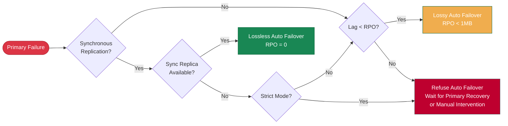

**RPO** (Recovery Point Objective) defines the **maximum amount of data loss** allowed when the primary fails.

For scenarios where data integrity is critical, such as financial transactions, RPO = 0 is typically required, meaning no data loss is allowed.

However, stricter RPO targets come at a cost: higher write latency, reduced system throughput, and the risk that replica failures may cause primary unavailability.
For typical scenarios, some data loss is acceptable (e.g., up to 1MB) in exchange for higher availability and performance.

--------

## Trade-offs

In asynchronous replication scenarios, there is typically some replication lag between replicas and the primary (depending on network and throughput, normally in the range of 10KB-100KB / 100µs-10ms).
This means when the primary fails, replicas may not have fully synchronized with the latest data. If a failover occurs, the new primary may lose some unreplicated data.

The upper limit of potential data loss is controlled by the [**`pg_rpo`**](/docs/pgsql/param#pg_rpo) parameter, which defaults to `1048576` (`1MB`), meaning up to 1MiB of data loss can be tolerated during failover.

When the cluster primary fails, if any replica has replication lag within this threshold, Pigsty will automatically promote that replica to be the new primary.
However, when all replicas exceed this threshold, Pigsty will refuse [**automatic failover**] to prevent data loss.
Manual intervention is then required to decide whether to wait for the primary to recover (which may never happen) or accept the data loss and force-promote a replica.

You need to configure this value based on your business requirements, making a **trade-off** between **availability** and **consistency**.
Increasing this value improves the success rate of automatic failover but also increases the upper limit of potential data loss.

When you set [**`pg_rpo`**](/docs/pgsql/param#pg_rpo) = 0, Pigsty enables **synchronous replication**, ensuring the primary only returns write success after at least one replica has persisted the data.
This configuration ensures zero replication lag but introduces significant write latency and reduces overall throughput.

-----------------

## Protection Modes

Pigsty provides three protection modes to help users make trade-offs under different RPO requirements, similar to [**Oracle Data Guard**](https://docs.oracle.com/en/database/oracle/oracle-database/21/sbydb/oracle-data-guard-protection-modes.html) protection modes.

{}
- **Default mode**, asynchronous replication, transactions commit with only local WAL persistence, no waiting for replicas, replica failures are completely transparent to the primary
- Primary failure may lose unsent/unreceived WAL (typically < 1MB, normally 10ms/100ms, 10KB/100KB range under normal network conditions)
- Optimized for performance, suitable for typical business scenarios that tolerate minor data loss during failures
{}

{}
- Configured with [**`pg_rpo = 0`**](/docs/pgsql/param#pg_rpo), enables Patroni synchronous commit mode: `synchronous_mode: true`
- Under normal conditions, waits for at least one replica confirmation, achieving zero data loss. When **all** sync replicas fail, **automatically degrades to async mode to continue service**
- Balances data safety and service availability, recommended configuration for production **critical business**
{}

{}
- Uses `crit.yml` template, enables Patroni strict synchronous mode: `synchronous_mode: true` / `synchronous_mode_strict: true`
- When all sync replicas fail, **primary refuses writes** to prevent data loss, transactions must be persisted on at least one replica before returning success
- Suitable for financial transactions, medical records, and other scenarios with extremely high data integrity requirements
{}

| **Name**                   |                     **Maximum Performance**                     |                         **Maximum Availability**                         |                    **Maximum Protection**                     |
|:---------------------------|:---------------------------------------------------------------:|:------------------------------------------------------------------------:|:-------------------------------------------------------------:|
| **Replication**            |                        **Asynchronous**                         |                             **Synchronous**                              |                    **Strict Synchronous**                     |
| **Data Loss**              | **Possible** (replication lag) | **Zero normally, minor when degraded** |          **Zero**           |
| **Write Latency**          |          **Lowest**           |      **Medium** (+1 network RTT)       | **Medium** (+1 network RTT) |
| **Throughput**             |          **Highest**          |              **Reduced**               |         **Reduced**         |
| **Replica Failure Impact** |           **None**            |  **Auto degrade, service continues**   |   **Primary stops writes**   |
| **RPO**                    |           **< 1MB**           |  **= 0 (normal) / < 1MB (degraded)**   |           **= 0**           |
| **Use Case**               |               Typical business, performance first               |                     Critical business, safety first                      |               Financial core, compliance first                |
| **Configuration**          |                         Default config                          |              [**`pg_rpo`**](/docs/pgsql/param#pg_rpo) = `0`              |    [**`pg_conf`**](/docs/pgsql/param#pg_conf): `crit.yml`     |
{.full-width}

------

## Implementation

The three protection modes differ in how two core **Patroni** parameters are configured: [**`synchronous_mode`**](https://patroni.readthedocs.io/en/latest/replication_modes.html#synchronous-mode) and [**`synchronous_mode_strict`**](https://patroni.readthedocs.io/en/latest/replication_modes.html#synchronous-mode):

- **`synchronous_mode`**: Whether Patroni enables synchronous replication. If enabled, check if **`synchronous_mode_strict`** enables strict synchronous mode.
- **`synchronous_mode_strict = false`**: Default configuration, allows degradation to async mode when replicas fail, **primary continues service** (Maximum Availability)
- **`synchronous_mode_strict = true`**: Degradation forbidden, **primary stops writes** until sync replica recovers (Maximum Protection)

|         Mode         |            **`synchronous_mode`**            |        **`synchronous_mode_strict`**         | Replication Mode       | Replica Failure Behavior                                    |
|:--------------------:|:--------------------------------------------:|:--------------------------------------------:|------------------------|:------------------------------------------------------------|
| **Max Performance**  | **`false`** |                      -                       | **Async**              | **No impact**             |
| **Max Availability** | **`true`** | **`false`** | **Synchronous**        | **Auto degrade to async** |
|  **Max Protection**  | **`true`** | **`true`** | **Strict Synchronous** | **Primary refuses writes** |
{.full-width}

Typically, you only need to set the [**`pg_rpo`**](/docs/pgsql/param#pg_rpo) parameter to `0` to enable the `synchronous_mode` switch, activating **Maximum Availability mode**.
If you use [**`pg_conf`**](/docs/pgsql/param#pg_conf) = [**`crit.yml`**](/docs/pgsql/template/crit) template, it additionally enables the `synchronous_mode_strict` strict mode switch, activating **Maximum Protection mode**.

You can also directly [**configure**](/docs/pgsql/admin/patroni#modify-config) these Patroni parameters as needed. Refer to Patroni and PostgreSQL documentation to achieve stronger data protection, such as:

- Specify the [**synchronous replica list**](/docs/pgsql/config/cluster#quorum-commit), configure more sync replicas to improve disaster tolerance, use quorum synchronous commit, or even require all replicas to perform synchronous commit.
- [**Configure**](/docs/pgsql/admin/patroni#modify-config) [**`synchronous_commit`**](https://www.postgresql.org/docs/current/runtime-config-wal.html#GUC-SYNCHRONOUS-COMMIT): `'remote_apply'` to strictly ensure primary-replica read-write consistency. (Oracle Maximum Protection mode is equivalent to `remote_write`)

------

## Recommendations

**Maximum Performance mode** (asynchronous replication) is the default mode used by Pigsty and is sufficient for the vast majority of workloads.
Tolerating minor data loss during failures (typically in the range of a few KB to hundreds of KB) in exchange for higher throughput and availability is the recommended configuration for typical business scenarios.
In this case, you can adjust the maximum allowed data loss through the [**`pg_rpo`**](/docs/pgsql/param#pg_rpo) parameter to suit different business needs.

**Maximum Availability mode** (synchronous replication) is suitable for scenarios with high data integrity requirements that cannot tolerate data loss.
In this mode, a minimum of two-node PostgreSQL cluster (one primary, one replica) is required.
Set [**`pg_rpo`**](/docs/pgsql/param#pg_rpo) to 0 to enable this mode.

**Maximum Protection mode** (strict synchronous replication) is suitable for financial transactions, medical records, and other scenarios with extremely high data integrity requirements. We recommend using at least a three-node cluster (one primary, two replicas),
because with only two nodes, if the replica fails, the primary will stop writes, causing service unavailability, which reduces overall system reliability. With three nodes, if only one replica fails, the primary can continue to serve.
