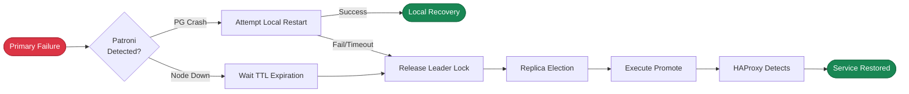

**RTO** (Recovery Time Objective) defines the **maximum time required for the system to restore write capability** when the primary fails.

For critical transaction systems where availability is paramount, the shortest possible RTO is typically required, such as under one minute.

However, shorter RTO comes at a cost: increased false failover risk. Network jitter may be misinterpreted as a failure, leading to unnecessary failovers.
For cross-datacenter/cross-region deployments, RTO requirements are typically relaxed (e.g., 1-2 minutes) to reduce false failover risk.

--------

## Trade-offs

The upper limit of unavailability during failover is controlled by the [**`pg_rto`**](/docs/pgsql/param#pg_rto) parameter. Pigsty provides four preset RTO modes:
`fast`, `norm`, `safe`, `wide`, each optimized for different network conditions and deployment scenarios. The default is `norm` mode (~45 seconds).
You can also specify the RTO upper limit directly in seconds, and the system will automatically map to the closest mode.

When the primary fails, the entire recovery process involves multiple phases: Patroni detects the failure, DCS lock expires, new primary election, promote execution, HAProxy detects the new primary.
Reducing RTO means shortening the timeout for each phase, which makes the cluster more sensitive to network jitter, thereby increasing false failover risk.

You need to choose the appropriate mode based on actual network conditions, balancing **recovery speed** and **false failover risk**.
The worse the network quality, the more conservative mode you should choose; the better the network quality, the more aggressive mode you can choose.




-----------------

## Four Modes

Pigsty provides four RTO modes to help users make trade-offs under different network conditions.

| **Name**                |                    **fast**                    |                   **norm**                   |                  **safe**                   |                    **wide**                    |
|:------------------------|:----------------------------------------------:|:--------------------------------------------:|:-------------------------------------------:|:----------------------------------------------:|
| **Use Case**            |                   Same rack                    |          Same datacenter (default)           |            Same region, cross-DC            |             Cross-region/continent             |
| **Network**             |               < 1ms, very stable               |                1-5ms, normal                 |              10-50ms, cross-DC              |           100-200ms, public network            |
| **Target RTO**          |   <span class="text-success">**30s**</span>    |  <span class="text-primary">**45s**</span>   |  <span class="text-warning">**90s**</span>  |   <span class="text-danger">**150s**</span>    |
| **False Failover Risk** | <span class="text-secondary">**Higher**</span> | <span class="text-primary">**Medium**</span> | <span class="text-success">**Lower**</span> | <span class="text-success">**Very Low**</span> |
| **Configuration**       |                 `pg_rto: fast`                 |                `pg_rto: norm`                |               `pg_rto: safe`                |                 `pg_rto: wide`                 |
{.full-width}


{}
- Suitable for scenarios with extremely low network latency (< 1ms) and very stable networks, such as same-rack or same-switch deployments
- Average RTO: **14s**, worst case: **29s**, TTL only 20s, check interval 5s
- Highest network quality requirements, any jitter may trigger failover, **higher false failover risk**
{}

{}
- **Default mode**, suitable for same-datacenter deployment, network latency 1-5ms, normal quality, reasonable packet loss rate
- Average RTO: **21s**, worst case: **43s**, TTL is 30s, provides reasonable tolerance window
- Balances recovery speed and stability, suitable for most production environments
{}

{}
- Suitable for same-region/same-area cross-datacenter deployment, network latency 10-50ms, occasional jitter possible
- Average RTO: **43s**, worst case: **91s**, TTL is 60s, longer tolerance window
- Primary restart wait time is longer (60s), gives more local recovery opportunities, **lower false failover risk**
{}

{}
- Suitable for cross-region or even cross-continent deployment, network latency 100-200ms, possible public-network-level packet loss
- Average RTO: **92s**, worst case: **207s**, TTL is 120s, very wide tolerance window
- Sacrifices recovery speed for extremely low false failover rate, suitable for geo-disaster recovery scenarios
{}

--------

## RTO Timeline

Patroni / PG HA has two critical failure paths. For detailed RTO timing analysis, see: [**Active Failure Detection**](/docs/concept/ha/failure/active) and [**Passive Lease Expiration**](/docs/concept/ha/failure/passive).


```js
var fmt = function(params) { if (!params || !params.length || params[0].name === '') return ''; return '<b>' + params[0].name + '</b><br/>' + params.filter(p => p.value !== '-' && p.value != null).map(p => p.marker + ' ' + p.seriesName + ': ' + p.value + 's').join('<br/>'); };
```
```yaml
tooltip: { trigger: axis, axisPointer: { type: shadow }, formatter: $fn:fmt }
legend: { top: 0, itemGap: 10, data: [Lease Expiration, Failure Detection, Restart Timeout, Replica Detection, Lock & Promote, Health Check] }
grid: { left: 110, right: 24, bottom: 32, top: 40 }
xAxis: { type: value, name: Seconds, nameLocation: end, max: 160, axisLine: { show: true }, axisTick: { show: true }, splitLine: { show: true, lineStyle: { type: dashed, opacity: 0.5 } }, minorTick: { show: true, splitNumber: 5 }, minorSplitLine: { show: true, lineStyle: { type: dotted, opacity: 0.2 } } }
yAxis: { type: category, axisLine: { show: true }, axisTick: { show: true }, splitLine: { show: false }, axisLabel: { fontSize: 9, fontFamily: monospace }, data: [wide-passive-max, wide-passive-avg, wide-passive-min, wide-active-max, wide-active-avg, wide-active-min, "", safe-passive-max, safe-passive-avg, safe-passive-min, safe-active-max, safe-active-avg, safe-active-min, "", norm-passive-max, norm-passive-avg, norm-passive-min, norm-active-max, norm-active-avg, norm-active-min, "", fast-passive-max, fast-passive-avg, fast-passive-min, fast-active-max, fast-active-avg, fast-active-min] }
series:
  - { name: Lease Expiration, type: bar, stack: main, barWidth: 16, z: 2, emphasis: { focus: series }, itemStyle: { color: "#e15759" }, data: [120, 110, 100, "-", "-", "-", "-", 60, 55, 50, "-", "-", "-", "-", 30, 27, 25, "-", "-", "-", "-", 20, 17, 15, "-", "-", "-"] }
  - { name: Failure Detection, type: bar, stack: main, z: 2, emphasis: { focus: series }, itemStyle: { color: "#b07aa1" }, data: ["-", "-", "-", 20, 10, 0, "-", "-", "-", "-", 10, 5, 0, "-", "-", "-", "-", 5, 3, 0, "-", "-", "-", "-", 5, 3, 0] }
  - { name: Restart Timeout, type: bar, stack: main, z: 2, emphasis: { focus: series }, itemStyle: { color: "#f28e2c" }, data: ["-", "-", "-", 95, 95, 0, "-", "-", "-", "-", 45, 45, 0, "-", "-", "-", "-", 25, 25, 0, "-", "-", "-", "-", 15, 15, 0] }
  - { name: Replica Detection, type: bar, stack: main, z: 2, emphasis: { focus: series }, itemStyle: { color: "#edc949" }, data: [20, 10, 0, 20, 10, 0, "-", 10, 5, 0, 10, 5, 0, "-", 5, 3, 0, 5, 3, 0, "-", 5, 3, 0, 5, 3, 0] }
  - { name: Lock & Promote, type: bar, stack: main, z: 2, emphasis: { focus: series }, itemStyle: { color: "#59a14f" }, data: [2, 1, 0, 2, 1, 0, "-", 2, 1, 0, 2, 1, 0, "-", 2, 1, 0, 2, 1, 0, "-", 2, 1, 0, 2, 1, 0] }
  - { name: Health Check, type: bar, stack: main, z: 2, emphasis: { focus: series }, itemStyle: { color: "#4e79a7" }, data: [8, 6, 4, 8, 6, 4, "-", 6, 5, 3, 6, 5, 3, "-", 4, 3, 2, 4, 3, 2, "-", 2, 2, 1, 2, 2, 1] }
  - { name: RTO Total, type: bar, barGap: "-100%", barWidth: 16, z: 1, itemStyle: { color: "#888", opacity: 0 }, emphasis: { itemStyle: { opacity: 0 } }, data: [150, 127, 104, 145, 122, 4, "-", 78, 66, 53, 73, 61, 3, "-", 41, 34, 27, 41, 35, 2, "-", 29, 23, 16, 29, 24, 1] }
  - { name: RTO Budget, type: bar, barGap: "-100%", barWidth: 16, z: 0, itemStyle: { color: "rgba(0,0,0,0.08)" }, emphasis: { itemStyle: { color: "rgba(0,0,0,0.12)" } }, data: [150, 150, 150, 150, 150, 150, "-", 90, 90, 90, 90, 90, 90, "-", 45, 45, 45, 45, 45, 45, "-", 30, 30, 30, 30, 30, 30] }
```



------

## Implementation

The four RTO modes differ in how the following 10 **Patroni** and **HAProxy** HA-related parameters are configured.

|   Component   |          Parameter          | **fast** | **norm** | **safe** | **wide** | Description                           |
|:-------------:|:---------------------------:|:--------:|:--------:|:--------:|:--------:|:--------------------------------------|
| **`patroni`** |          **`ttl`**          |    20    |    30    |    60    |   120    | Leader lock TTL (seconds)             |
|               |       **`loop_wait`**       |    5     |    5     |    10    |    20    | HA loop check interval (seconds)      |
|               |     **`retry_timeout`**     |    5     |    10    |    20    |    30    | DCS operation retry timeout (seconds) |
|               | **`primary_start_timeout`** |    15    |    25    |    45    |    95    | Primary restart wait time (seconds)   |
|               |     **`safety_margin`**     |    5     |    5     |    10    |    15    | Watchdog safety margin (seconds)      |
| **`haproxy`** |         **`inter`**         |    1s    |    2s    |    3s    |    4s    | Normal state check interval           |
|               |       **`fastinter`**       |   0.5s   |    1s    |   1.5s   |    2s    | State transition check interval       |
|               |       **`downinter`**       |    1s    |    2s    |    3s    |    4s    | DOWN state check interval             |
|               |         **`rise`**          |    3     |    3     |    3     |    3     | Consecutive successes to mark UP      |
|               |         **`fall`**          |    3     |    3     |    3     |    3     | Consecutive failures to mark DOWN     |
{.full-width}


### Patroni Parameters

- **`ttl`**: Leader lock TTL. Primary must renew within this time, otherwise lock expires and triggers election. Directly determines passive failure detection delay.
- **`loop_wait`**: Patroni main loop interval. Each loop performs one health check and state sync, affects failure discovery timeliness.
- **`retry_timeout`**: DCS operation retry timeout. During network partition, Patroni retries continuously within this period; after timeout, primary actively demotes to prevent split-brain.
- **`primary_start_timeout`**: Wait time for Patroni to attempt local restart after PG crash. After timeout, releases Leader lock and triggers failover.
- **`safety_margin`**: Watchdog safety margin. Ensures sufficient time to trigger system restart during failures, avoiding split-brain.

### HAProxy Parameters

- **`inter`**: Health check interval in normal state, used when service status is stable.
- **`fastinter`**: Check interval during state transition, uses shorter interval to accelerate confirmation when state change detected.
- **`downinter`**: Check interval in DOWN state, uses this interval to probe recovery after service marked DOWN.
- **`rise`**: Consecutive successes required to mark UP. After new primary comes online, must pass `rise` consecutive checks before receiving traffic.
- **`fall`**: Consecutive failures required to mark DOWN. Service must fail `fall` consecutive times before being marked DOWN.

### Key Constraint

**Patroni core constraint**: Ensures primary can complete demotion before TTL expires, preventing split-brain.

```math
loop\_wait + 2 \times retry\_timeout \leq ttl
```


------

## Recommendations

**fast mode** is suitable for scenarios with extremely high RTO requirements, but requires sufficiently good network quality (latency < 1ms, very low packet loss).
Recommended only for same-rack or same-switch deployments, and should be thoroughly tested in production before enabling.

**norm mode** (**default**) is Pigsty's default configuration, sufficient for the vast majority of same-datacenter deployments.
An average recovery time of 21 seconds is within acceptable range while providing a reasonable tolerance window to avoid false failovers from network jitter.

**safe mode** is suitable for same-city cross-datacenter deployments with higher network latency or occasional jitter.
The longer tolerance window effectively prevents false failovers from network jitter, making it the recommended configuration for cross-datacenter disaster recovery.

**wide mode** is suitable for cross-region or even cross-continent deployments with high network latency and possible public-network-level packet loss.
In such scenarios, stability is more important than recovery speed, so an extremely wide tolerance window ensures very low false failover rate.

| Scenario                            | Recommended Mode | Rationale                                                           |
|:------------------------------------|:-----------------|:--------------------------------------------------------------------|
| Dev/Test environment                | fast             | Quick feedback, low impact from false failover                      |
| Same-datacenter production          | norm             | Default choice, well-balanced                                       |
| Same-city active-active/cross-DC DR | safe             | Tolerates network jitter, reduces false failover                    |
| Geo-DR/cross-country deployment     | wide             | Adapts to high-latency public network, very low false failover rate |
| Uncertain network quality           | safe             | Conservative choice, avoids false failover                          |
{.full-width}


Typically you only need to set [**`pg_rto`**](/docs/pgsql/param#pg_rto) to the mode name, and Pigsty will automatically configure Patroni and HAProxy parameters.
For backward compatibility, Pigsty still supports configuring RTO directly in seconds, but the effect is equivalent to specifying `norm` mode.

The mode configuration actually loads the corresponding parameter set from [**`pg_rto_plan`**](/docs/pgsql/param#pg_rto_plan). You can modify or override this configuration to implement custom RTO strategies.

```yaml
pg_rto_plan:  # [ttl, loop, retry, start, margin, inter, fastinter, downinter, rise, fall]
  fast: [ 20  ,5  ,5  ,15 ,5  ,'1s' ,'0.5s' ,'1s' ,3 ,3 ]  # rto < 30s
  norm: [ 30  ,5  ,10 ,25 ,5  ,'2s' ,'1s'   ,'2s' ,3 ,3 ]  # rto < 45s
  safe: [ 60  ,10 ,20 ,45 ,10 ,'3s' ,'1.5s' ,'3s' ,3 ,3 ]  # rto < 90s
  wide: [ 120 ,20 ,30 ,95 ,15 ,'4s' ,'2s'   ,'4s' ,3 ,3 ]  # rto < 150s
```
