## Overview

**Recovery Time Objective (RTO)** and **Recovery Point Objective (RPO)** are two parameters requiring careful tradeoffs when designing high availability clusters.

* **RTO** (Recovery Time Objective) defines the **maximum time needed to restore write capability** when the primary fails.
* **RPO** (Recovery Point Objective) defines the **maximum amount of data that can be lost** when the primary fails.

The default **RTO** and **RPO** values used by Pigsty meet reliability requirements for most scenarios. You can adjust them based on your hardware level, network quality, and business requirements.

{}
Too small an RTO increases false positive rates; too small an RPO reduces the probability of successful automatic failover. Both require performance as a tradeoff.
{}

The upper limit of unavailability during failover is controlled by the [**`pg_rto`**](/docs/pgsql/param#pg_rto) parameter. **RTO** defaults to `30s`. Increasing it results in longer primary failure write unavailability, while decreasing it increases false positive failover rates (e.g., repeated switching due to brief network jitter).

The upper limit of potential data loss is controlled by the [**`pg_rpo`**](/docs/pgsql/param#pg_rpo) parameter, defaulting to `1MB`. Reducing this value lowers the data loss ceiling during failover but increases the probability of refusing automatic failover when replicas are not healthy enough (lagging too far).


-----------

## Parameter Details

### [**`pg_rto`**](/docs/pgsql/param#pg_rto)

Recovery Time Objective (RTO) in seconds, defaults to `30` seconds, meaning the primary can be expected to restore write capability within 30 seconds after failure.

If the primary instance is missing for this long, a new leader election will be triggered. This value is not always better when lower; it involves tradeoffs:
Reducing this value decreases cluster failover unavailability (inability to write) but makes the cluster more sensitive to short-term network jitter, increasing false positive failover triggers.
You need to configure this value based on network conditions and business constraints, making a **tradeoff** between **failure probability** and **failure impact**.


### [**`pg_rpo`**](/docs/pgsql/param#pg_rpo)

Recovery Point Objective (RPO) in bytes, default: `1048576` (1MiB), meaning up to 1MiB of data loss can be tolerated during failover.

When the primary goes down and all replicas are lagging, you must make a difficult choice:
Either promote a replica immediately, accepting acceptable data loss (e.g., less than 1MB), and restore service quickly.
Or wait for the primary to come back online (which may never happen) to avoid any data loss, or abandon automatic failover and wait for human intervention.
You need to configure this value based on business preference, making a **tradeoff** between **availability** and **consistency**.

Additionally, you can always ensure RPO = 0 by enabling synchronous commit (e.g., using the `crit.yml` template), sacrificing cluster latency/throughput performance.


-----------------

## Protection Modes

For RPO (data loss) tradeoffs, you can reference Oracle Data Guard's three protection mode design philosophy.

Oracle Data Guard provides three protection modes. PostgreSQL can also implement these three classic HA switchover strategies through configuration.

**Maximum Performance**
- Default mode, using Patroni config templates other than `crit.yml`, Patroni `synchronous_mode: false`, sync replication disabled
- Transaction commit only requires local WAL persistence, no replica wait, replica failures are completely transparent to primary
- Primary failure may lose unsent/unreceived WAL (typically < 1MB, normally 10ms/100ms latency, 10KB/100KB magnitude under good network)
- Optimized for performance, suitable for regular business scenarios that can tolerate minor data loss during failures

**Maximum Availability**
- Pigsty uses `crit.yml` template with `synchronous_mode: true` + `synchronous_mode_strict: false`
- Under normal conditions, waits for at least one replica to confirm, achieving zero data loss. When **all** sync replicas fail, **automatically degrades to async mode to continue service**
- Balances data safety and service availability, recommended configuration for production core business

**Maximum Protection**
- Pigsty uses `crit.yml` template with Patroni `synchronous_mode: true` and further configured to strict sync mode
- Configure `synchronous_mode_strict: true`, when all sync replicas fail, **primary refuses writes** to prevent data loss
- Can configure `synchronous_commit: 'remote_apply'` for read-write consistency
- Transactions must be persisted on at least one replica before returning success, can specify sync replica list, configure more sync replicas for better disaster tolerance
- Suitable for financial transactions, medical records, and other scenarios requiring extremely high data integrity


| Dimension | Max Performance | Max Availability | Max Protection |
|:--|:--|:--|:--|
| **Name** | Maximum Performance | Maximum Availability | Maximum Protection |
| **Replication** | <span class="text-warning">**Async**</span> | <span class="text-success">**Sync**</span> | <span class="text-success">**Sync**</span> |
| **Data Loss** | <span class="text-danger">**Possible**</span> (replication lag) | <span class="text-primary">**Zero normally, minor when degraded**</span> | <span class="text-success">**Zero**</span> |
| **Primary Write Latency** | <span class="text-success">**Lowest**</span> | <span class="text-warning">**Medium**</span> (+1 network round trip) | <span class="text-warning">**Medium**</span> (+1 network round trip) |
| **Throughput** | <span class="text-success">**Highest**</span> | <span class="text-warning">**Lower**</span> | <span class="text-danger">**Lower**</span> |
| **Replica Failure Impact** | <span class="text-success">**None**</span> | <span class="text-primary">**Auto degrade, continue service**</span> | <span class="text-danger">**Primary stops writes**</span> |
| **RPO** | <span class="text-warning">**< 1MB**</span> | <span class="text-primary">**= 0 (normal) / < 1MB (degraded)**</span> | <span class="text-success">**= 0**</span> |
| **Use Case** | Regular business, performance-first | Important business, safety-first | Financial core, compliance-first |
| **Pigsty Config** | Default | `pg_conf: crit.yml` | `pg_conf: crit.yml` + strict mode |
{.full-width}

The three modes differ in how Patroni's two core parameters are configured: [**`synchronous_mode`**](https://patroni.readthedocs.io/en/latest/replication_modes.html#synchronous-mode) and [**`synchronous_mode_strict`**](https://patroni.readthedocs.io/en/latest/replication_modes.html#synchronous-mode)

- **`synchronous_mode`**: Whether Patroni enables sync replication. If enabled, check **`synchronous_mode_strict`** for strict sync mode.
- **`synchronous_mode_strict = false`**: Default, allows degrading to async mode when replicas fail, **primary continues service** (Maximum Availability)
- **`synchronous_mode_strict = true`**: Disables degradation, **primary stops writes** until sync replicas recover (Maximum Protection)

| Mode | **`synchronous_mode`** | **`synchronous_mode_strict`** | Replica Failure Behavior |
|:--|:--:|:--:|:--|
| **Max Performance** | <span class="text-danger">**`false`**</span> | - | <span class="text-success">**No impact**</span> |
| **Max Availability** | <span class="text-success">**`true`**</span> | <span class="text-danger">**`false`**</span> | <span class="text-primary">**Auto degrade to async**</span> |
| **Max Protection** | <span class="text-success">**`true`**</span> | <span class="text-success">**`true`**</span> | <span class="text-danger">**Primary refuses writes**</span> |
{.full-width}


Pigsty uses **availability-first** mode by default, meaning it will failover as quickly as possible when the primary fails, and data not yet replicated to replicas may be lost (under typical 10GbE networks, replication lag is usually a few KB to 100KB).
If you need zero data loss during failover, use the [**`crit.yml`**](/docs/pgsql/param#pg_conf) template for consistency-first mode to ensure no data loss during failover, but this sacrifices some performance (latency/throughput).

**Maximum Protection** mode requires additional `synchronous_mode_strict: true` configuration, which causes the primary to stop write service when all sync replicas fail! Ensure you have at least **two sync replicas**, or accept this risk before enabling this mode.


-----------------

## Failover Timing

For RTO (recovery time) tradeoffs, analyze using the Patroni failure detection and switchover timing diagram below.

**Recovery Time Objective (RTO)** consists of multiple phases:


| Parameter | Impact | Tuning Advice |
|:--|:--|:--|
| `pg_rto` | Baseline for TTL/loop_wait/retry_timeout | Can reduce to 15-20s on stable networks |
| `ttl` | Failure detection time window | = pg_rto |
| `loop_wait` | Patroni check interval | = pg_rto / 3 |
| `inter` | HAProxy health check interval | Can reduce to 1-2s |
| `fall` | Failure determination count | Can reduce to 2 |
| `rise` | Recovery determination count | Can reduce to 2 |

When the primary fails, the system goes through these phases:

```mermaid
sequenceDiagram
    autonumber
    participant Primary as 🟢 Primary
    participant Patroni_P as Patroni (Primary)
    participant Etcd as 🟠 Etcd Cluster
    participant Patroni_R as Patroni (Replica)
    participant Replica as 🔵 Replica
    participant HAProxy as HAProxy

    Note over Primary: T=0s Primary failure occurs

    rect rgb(255, 235, 235)
        Note right of Primary: Failure Detection Phase (0-10s)
        Primary-x Patroni_P: Process crash
        Patroni_P--x Etcd: Stop lease renewal
        HAProxy--x Patroni_P: Health check fails
        Etcd->>Etcd: Lease countdown starts
    end

    rect rgb(255, 248, 225)
        Note right of Etcd: Election Phase (10-20s)
        Etcd->>Etcd: Lease expires, release leader lock
        Patroni_R->>Etcd: Check eligibility (LSN, replication lag)
        Etcd->>Patroni_R: Grant leader lock
    end

    rect rgb(232, 245, 233)
        Note right of Replica: Promotion Phase (20-30s)
        Patroni_R->>Replica: Execute PROMOTE
        Replica-->>Replica: Promoted to new primary
        Patroni_R->>Etcd: Update state
        HAProxy->>Patroni_R: Health check /primary
        Patroni_R-->>HAProxy: 200 OK
    end

    Note over HAProxy: T≈30s Service restored
    HAProxy->>Replica: Route write traffic to new primary
```



**Key timing formula**:

```
RTO ≈ TTL + Election_Time + Promote_Time + HAProxy_Detection

Where:
- TTL = pg_rto (default 30s)
- Election_Time ≈ 1-2s
- Promote_Time ≈ 1-5s
- HAProxy_Detection = fall × inter + rise × fastinter ≈ 12s

Actual RTO is typically 15-40s, depending on:
- Network latency
- Replica WAL replay progress
- PostgreSQL recovery speed
```


