Pigsty allows you to use a PostgreSQL **metabase** as a dynamic configuration source, replacing static YAML configuration files for more powerful configuration management capabilities.

------

## Overview

**CMDB** (Configuration Management Database) is a method of storing configuration information in a database for management.

In Pigsty, the default configuration source is a static YAML file `pigsty.yml`,
which serves as Ansible's [**inventory**](/docs/concept/iac/inventory/).

This approach is simple and direct, but when infrastructure scales and requires complex, fine-grained management and external integration, a single static file becomes insufficient.

|    Feature    | Static YAML File           | CMDB Metabase                          |
|:-------------:|:---------------------------|:---------------------------------------|
| **Querying**  | Manual search/grep         | SQL queries with any conditions, aggregation analysis |
| **Versioning** | Depends on Git or manual backup | Database transactions, audit logs, time-travel snapshots |
| **Access Control** | File system permissions, coarse-grained | PostgreSQL fine-grained access control |
| **Concurrent Editing** | Requires file locking or merge conflicts | Database transactions naturally support concurrency |
| **External Integration** | Requires YAML parsing | Standard SQL interface, easy integration with any language |
| **Scalability** | Difficult to maintain when file becomes too large | Scales to physical limits |
| **Dynamic Generation** | Static file, changes require manual application | Immediate effect, real-time configuration changes |

Pigsty provides the CMDB database schema in the sample database [**`pg-meta.meta`**](https://github.com/pgsty/pigsty/blob/main/conf/meta.yml#L52) schema baseline definition.


-----------------

## How It Works

The core idea of CMDB is to replace the static configuration file with a **dynamic script**.
Ansible supports using executable scripts as inventory, as long as the script outputs inventory data in JSON format.
When you enable CMDB, Pigsty creates a dynamic inventory script named `inventory.sh`:

```bash
#!/bin/bash
psql ${METADB_URL} -AXtwc 'SELECT text FROM pigsty.inventory;'
```

This script's function is simple: every time Ansible needs to read the inventory, it queries configuration data from the PostgreSQL database's `pigsty.inventory` view and returns it in JSON format.

The overall architecture is as follows:

```mermaid
flowchart LR
    conf["bin/inventory_conf"]
    tocmdb["bin/inventory_cmdb"]
    load["bin/inventory_load"]
    ansible["🚀 Ansible"]

    subgraph static["📄 Static Config Mode"]
        yml[("pigsty.yml")]
    end

    subgraph dynamic["🗄️ CMDB Dynamic Mode"]
        sh["inventory.sh"]
        cmdb[("PostgreSQL CMDB")]
    end

    conf -->|"switch"| yml
    yml -->|"load config"| load
    load -->|"write"| cmdb
    tocmdb -->|"switch"| sh
    sh --> cmdb

    yml --> ansible
    cmdb --> ansible
```




-----------------

## Data Model

The CMDB database schema is defined in [`files/cmdb.sql`](https://github.com/pgsty/pigsty/blob/main/files/cmdb.sql), with all objects in the `pigsty` schema.

### Core Tables

| Table | Description | Primary Key |
|:---:|:---|:---:|
| `pigsty.group` | Cluster/group definitions, corresponds to Ansible groups | `cls` |
| `pigsty.host` | Host definitions, belongs to a group | `(cls, ip)` |
| `pigsty.global_var` | Global variables, corresponds to `all.vars` | `key` |
| `pigsty.group_var` | Group variables, corresponds to `all.children.<cls>.vars` | `(cls, key)` |
| `pigsty.host_var` | Host variables, host-level variables | `(cls, ip, key)` |
| `pigsty.default_var` | Default variable definitions, stores parameter metadata | `key` |
| `pigsty.job` | Job records table, records executed tasks | `id` |

### Table Structure Details

**Cluster Table `pigsty.group`**

```sql
CREATE TABLE pigsty.group (
    cls     TEXT PRIMARY KEY,        -- Cluster name, primary key
    ctime   TIMESTAMPTZ DEFAULT now(), -- Creation time
    mtime   TIMESTAMPTZ DEFAULT now()  -- Modification time
);
```

**Host Table `pigsty.host`**

```sql
CREATE TABLE pigsty.host (
    cls    TEXT NOT NULL REFERENCES pigsty.group(cls),  -- Parent cluster
    ip     INET NOT NULL,                               -- Host IP address
    ctime  TIMESTAMPTZ DEFAULT now(),
    mtime  TIMESTAMPTZ DEFAULT now(),
    PRIMARY KEY (cls, ip)
);
```

**Global Variables Table `pigsty.global_var`**

```sql
CREATE TABLE pigsty.global_var (
    key   TEXT PRIMARY KEY,           -- Variable name
    value JSONB NULL,                 -- Variable value (JSON format)
    mtime TIMESTAMPTZ DEFAULT now()   -- Modification time
);
```

**Group Variables Table `pigsty.group_var`**

```sql
CREATE TABLE pigsty.group_var (
    cls   TEXT NOT NULL REFERENCES pigsty.group(cls),
    key   TEXT NOT NULL,
    value JSONB NULL,
    mtime TIMESTAMPTZ DEFAULT now(),
    PRIMARY KEY (cls, key)
);
```

**Host Variables Table `pigsty.host_var`**

```sql
CREATE TABLE pigsty.host_var (
    cls   TEXT NOT NULL,
    ip    INET NOT NULL,
    key   TEXT NOT NULL,
    value JSONB NULL,
    mtime TIMESTAMPTZ DEFAULT now(),
    PRIMARY KEY (cls, ip, key),
    FOREIGN KEY (cls, ip) REFERENCES pigsty.host(cls, ip)
);
```


### Core Views

CMDB provides a series of views for querying and displaying configuration data:

| View | Description |
|:---:|:---|
| `pigsty.inventory` | **Core view**: Generates Ansible dynamic inventory JSON |
| `pigsty.raw_config` | Raw configuration in JSON format |
| `pigsty.global_config` | Global config view, merges defaults and global vars |
| `pigsty.group_config` | Group config view, includes host list and group vars |
| `pigsty.host_config` | Host config view, merges group and host-level vars |
| `pigsty.pg_cluster` | PostgreSQL cluster view |
| `pigsty.pg_instance` | PostgreSQL instance view |
| `pigsty.pg_database` | PostgreSQL database definition view |
| `pigsty.pg_users` | PostgreSQL user definition view |
| `pigsty.pg_service` | PostgreSQL service definition view |
| `pigsty.pg_hba` | PostgreSQL HBA rules view |
| `pigsty.pg_remote` | Remote PostgreSQL instance view |

**`pigsty.inventory`** is the core view that converts database configuration data to the JSON format required by Ansible:

```sql
SELECT text FROM pigsty.inventory;
```


-----------------

## Utility Scripts

Pigsty provides three convenience scripts for managing CMDB:

| Script | Function |
|:---:|:---|
| [`bin/inventory_load`](https://github.com/pgsty/pigsty/blob/main/bin/inventory_load) | Load YAML configuration file into PostgreSQL database |
| [`bin/inventory_cmdb`](https://github.com/pgsty/pigsty/blob/main/bin/inventory_cmdb) | Switch configuration source to CMDB (dynamic inventory script) |
| [`bin/inventory_conf`](https://github.com/pgsty/pigsty/blob/main/bin/inventory_conf) | Switch configuration source to static config file `pigsty.yml` |


### inventory_load

Parse and import YAML configuration file into CMDB:

```bash
bin/inventory_load                     # Load default pigsty.yml to default CMDB
bin/inventory_load -p /path/to/conf.yml  # Specify configuration file path
bin/inventory_load -d "postgres://..."   # Specify database connection URL
bin/inventory_load -n myconfig           # Specify configuration name
```

The script performs the following operations:

1. Clears existing data in the `pigsty` schema
2. Parses the YAML configuration file
3. Writes global variables to the `global_var` table
4. Writes cluster definitions to the `group` table
5. Writes cluster variables to the `group_var` table
6. Writes host definitions to the `host` table
7. Writes host variables to the `host_var` table

**Environment Variables**

- `PIGSTY_HOME`: Pigsty installation directory, defaults to `~/pigsty`
- `METADB_URL`: Database connection URL, defaults to `service=meta`


### inventory_cmdb

Switch Ansible to use CMDB as the configuration source:

```bash
bin/inventory_cmdb
```

The script performs the following operations:

1. Creates dynamic inventory script `${PIGSTY_HOME}/inventory.sh`
2. Modifies `ansible.cfg` to set `inventory` to `inventory.sh`

The generated `inventory.sh` contents:

```bash
#!/bin/bash
psql ${METADB_URL} -AXtwc 'SELECT text FROM pigsty.inventory;'
```


### inventory_conf

Switch back to using static YAML configuration file:

```bash
bin/inventory_conf
```

The script modifies `ansible.cfg` to set `inventory` back to `pigsty.yml`.


-----------------

## Usage Workflow

### First-time CMDB Setup

1. **Initialize CMDB schema** (usually done automatically during Pigsty installation):

```bash
psql -f ~/pigsty/files/cmdb.sql
```

2. **Load configuration to database**:

```bash
bin/inventory_load
```

3. **Switch to CMDB mode**:

```bash
bin/inventory_cmdb
```

4. **Verify configuration**:

```bash
ansible all --list-hosts          # List all hosts
ansible-inventory --list          # View complete inventory
```


### Query Configuration

After enabling CMDB, you can flexibly query configuration using SQL:

```sql
-- View all clusters
SELECT cls FROM pigsty.group;

-- View all hosts in a cluster
SELECT ip FROM pigsty.host WHERE cls = 'pg-meta';

-- View global variables
SELECT key, value FROM pigsty.global_var;

-- View cluster variables
SELECT key, value FROM pigsty.group_var WHERE cls = 'pg-meta';

-- View all PostgreSQL clusters
SELECT cls, name, pg_databases, pg_users FROM pigsty.pg_cluster;

-- View all PostgreSQL instances
SELECT cls, ins, ip, seq, role FROM pigsty.pg_instance;

-- View all database definitions
SELECT cls, datname, owner, encoding FROM pigsty.pg_database;

-- View all user definitions
SELECT cls, name, login, superuser FROM pigsty.pg_users;
```


### Modify Configuration

You can modify configuration directly via SQL:

```sql
-- Add new cluster
INSERT INTO pigsty.group (cls) VALUES ('pg-new');

-- Add cluster variable
INSERT INTO pigsty.group_var (cls, key, value)
VALUES ('pg-new', 'pg_cluster', '"pg-new"');

-- Add host
INSERT INTO pigsty.host (cls, ip) VALUES ('pg-new', '10.10.10.20');

-- Add host variables
INSERT INTO pigsty.host_var (cls, ip, key, value)
VALUES ('pg-new', '10.10.10.20', 'pg_seq', '1'),
       ('pg-new', '10.10.10.20', 'pg_role', '"primary"');

-- Modify global variable
UPDATE pigsty.global_var SET value = '"new-value"' WHERE key = 'some_param';

-- Delete cluster (cascades to hosts and variables)
DELETE FROM pigsty.group WHERE cls = 'pg-old';
```

Changes take effect immediately without reloading or restarting any service.


### Switch Back to Static Configuration

To switch back to static configuration file mode:

```bash
bin/inventory_conf
```


-----------------

## Advanced Usage

### Export Configuration

Export CMDB configuration to YAML format:

```bash
psql service=meta -AXtwc "SELECT jsonb_pretty(jsonb_build_object('all', jsonb_build_object('children', children, 'vars', vars))) FROM pigsty.raw_config;"
```

Or use the `ansible-inventory` command:

```bash
ansible-inventory --list --yaml > exported_config.yml
```


### Configuration Auditing

Track configuration changes using the `mtime` field:

```sql
-- View recently modified global variables
SELECT key, value, mtime FROM pigsty.global_var
ORDER BY mtime DESC LIMIT 10;

-- View changes after a specific time
SELECT * FROM pigsty.group_var
WHERE mtime > '2024-01-01'::timestamptz;
```


### Integration with External Systems

CMDB uses standard PostgreSQL, making it easy to integrate with other systems:

- **Web Management Interface**: Expose configuration data through REST API (e.g., PostgREST)
- **CI/CD Pipelines**: Read/write database directly in deployment scripts
- **Monitoring & Alerting**: Generate monitoring rules based on configuration data
- **ITSM Systems**: Sync with enterprise CMDB systems


-----------------

## Considerations

1. **Data Consistency**: After modifying configuration, you need to re-run the corresponding Ansible playbooks to apply changes to the actual environment

2. **Backup**: Configuration data in CMDB is critical, ensure regular backups

3. **Permissions**: Configure appropriate database access permissions for CMDB to avoid accidental modifications

4. **Transactions**: When making batch configuration changes, perform them within a transaction for rollback on errors

5. **Connection Pooling**: The `inventory.sh` script creates a new connection on each execution; if Ansible runs frequently, consider using connection pooling


-----------------

## Summary

CMDB is Pigsty's advanced configuration management solution, suitable for scenarios requiring large-scale cluster management, complex queries, external integration, or fine-grained access control. By storing configuration data in PostgreSQL, you can fully leverage the database's powerful capabilities to manage infrastructure configuration.

|      Feature      |           Description           |
|:-----------------:|:-------------------------------:|
|   **Storage**     | PostgreSQL `pigsty` schema      |
| **Dynamic Inventory** |   `inventory.sh` script     |
|  **Config Load**  |  `bin/inventory_load`           |
| **Switch to CMDB** |  `bin/inventory_cmdb`          |
| **Switch to YAML** |  `bin/inventory_conf`          |
|   **Core View**   |   `pigsty.inventory`            |
