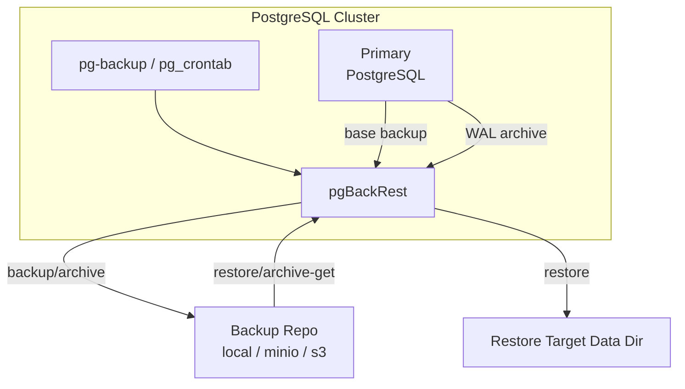

Pigsty uses [**pgBackRest**](https://pgbackrest.org/) as the PostgreSQL backup and recovery engine, providing out-of-the-box Point-in-Time Recovery (PITR).

This page explains the architecture: **who runs backups, where data flows, how repositories are organized, and how continuity is kept after failover**.


--------

## Overview

PITR architecture has three main pipelines: **backup execution**, **WAL archiving**, **restore execution**.

| Pipeline | Entry | Engine | Destination |
|:-----------|:--------------------------------------|:----------------------------------|:----------------------------------|
| Backup | `pg-backup` + `pg_crontab` | `pgbackrest backup` | repo `backup/` |
| WAL Archive | PostgreSQL `archive_command` | `pgbackrest archive-push` | repo `archive/` |
| Restore | `pg_pitr` / `pg-pitr` / `pgsql-pitr.yml` | `pgbackrest restore` | target data directory |
{.full-width}

See [**Backup Mechanism**](/docs/pgsql/backup/mechanism/) and [**Restore Operations**](/docs/pgsql/backup/restore/) for details.


--------

## Components and Responsibilities

| Component | Role | Description |
|:-------------------------|:-----------|:---------------------------------------------------------------------|
| **PostgreSQL** | Data source | Generates data files and WAL archive stream |
| **pgBackRest** | Backup engine | Runs backups, receives WAL, performs restore |
| **pg-backup** | Backup entry | Pigsty wrapper for `pgbackrest backup` |
| **pg_pitr / pg-pitr** | Restore entry | Pigsty params/script for `pgbackrest restore` |
| **Backup repository** | Storage backend | Stores `backup/` and `archive/`, supports `local` / `minio` / `s3` |
| **pgbackrest_exporter** | Metrics output | Exports backup status metrics, default port `9854` |
{.full-width}


--------

## Data Flow



Key points:

- **Backup** is triggered by `pg-backup`, executing `pgbackrest backup` to write base backups.
- **Archiving** is triggered by PostgreSQL `archive_command`, pushing WAL segments to repo.
- **Restore** reads backup and WAL from repo, rebuilding data dir via `pgbackrest restore`.


--------

## Deployment and Roles

pgBackRest is installed on **all PostgreSQL nodes**, but only the **primary** executes backups:

- `pg-backup` detects node role; replicas exit directly.
- After **failover**, the new primary takes over backup/archiving automatically.

This decouples backup pipeline from HA topology and avoids interruptions on switchover.


--------

## Repository and Isolation

### Stanza (Cluster Identity)

pgBackRest uses **stanza** to isolate cluster backups, mapped to `pg_cluster` in Pigsty:

```text
backup-repo
├── pg-meta/
│   ├── backup/
│   └── archive/
└── pg-test/
    ├── backup/
    └── archive/
```

### Repository Types

Pigsty selects repo type via [`pgbackrest_method`](/docs/pgsql/param#pgbackrest_method) and config via
[`pgbackrest_repo`](/docs/pgsql/param#pgbackrest_repo):

| Type | Characteristics | Use Cases |
|:------------|:---------------------------|:---------------------------|
| **local** | Local disk, fastest restore | Dev/test, single node |
| **minio** | Object storage, centralized | Production, DR |
| **s3** | Cloud object storage | Cloud, cross-region DR |
{.full-width}

Production should use remote repo (MinIO/S3) to avoid **data and backups lost together** on host failure.
See [**Backup Repository**](/docs/pgsql/backup/repository/).


--------

## Config Mapping

Pigsty renders `pgbackrest_repo` into `/etc/pgbackrest/pgbackrest.conf`.
Backup logs are under `/pg/log/pgbackrest/`, restore generates temporary config and logs.

See [**Backup Mechanism**](/docs/pgsql/backup/mechanism/) for details.


--------

## Observability

`pgbackrest_exporter` exports backup status metrics (last backup time, type, size, etc), enabled by default on port `9854`.
You can control it with [`pgbackrest_exporter_enabled`](/docs/pgsql/param#pgbackrest_exporter_enabled).


--------

## Related Docs

- [**Backup Mechanism**](/docs/pgsql/backup/mechanism/)
- [**Backup Policy**](/docs/pgsql/backup/policy/)
- [**Backup Repository**](/docs/pgsql/backup/repository/)
- [**Restore Operations**](/docs/pgsql/backup/restore/)
