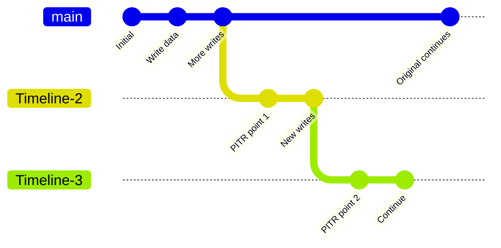

The core principle of PITR is: **base backup + WAL archiving = recover to any point in time**.
In Pigsty, this is implemented by **pgBackRest**, running **scheduled backups + WAL archiving** automatically.

--------

## Three Elements

| Element | Purpose | Pigsty Implementation |
|:------------|:---------------------------|:----------------------------------------------------------|
| **Base Backup** | Provides a consistent physical snapshot, recovery starting point | `pg-backup` + `pgbackrest` + [`pg_crontab`](/docs/pgsql/param#pg_crontab) |
| **WAL Archiving** | Records all changes after backup, defines recovery path | `archive_mode=on` + `archive_command=pgbackrest ... archive-push` |
| **Recovery Target** | Specifies where to stop recovery | `pg_pitr` params / `pg-pitr` script / `pgbackrest restore` |
{.full-width}

--------

## Base Backup

**Base backup** is a physical snapshot at a point in time, the starting point of PITR. Pigsty uses `pgBackRest` and provides `pg-backup` wrapper for common ops.

### Backup Types

| Type | Description | Restore Cost |
|:--------------------------|:-------------------------|:-------------------------|
| **Full** | Copies all data files | Fastest restore, largest space |
| **Differential** | Changes since latest full | Restore needs full + diff |
| **Incremental** | Changes since latest any backup | Smallest space, restore needs full chain |
{.full-width}

### Pigsty Defaults

- `pg-backup` **defaults to incremental**, and auto-runs a full if none exists.
- Backup jobs are configured via [`pg_crontab`](/docs/pgsql/param#pg_crontab) and written to `postgres` crontab.
- Script detects role; **only primary runs**, replicas exit.

Higher backup frequency means less WAL to replay and faster recovery.
See [**Backup Mechanism**](/docs/pgsql/backup/mechanism/) and [**Backup Policy**](/docs/pgsql/backup/policy/).

--------

## WAL Archiving

**WAL** (Write-Ahead Log) records every database change. PITR relies on continuous WAL archiving to replay to the target time.

### Pigsty Archiving Pipeline

Pigsty enables WAL archiving by default, using pgBackRest:

- `archive_mode = on`
- `archive_command = pgbackrest --stanza=<cluster> archive-push %p`

pgBackRest continuously receives WAL segments and cleans expired archives per retention policy.
During recovery, pgBackRest uses `archive-get` to pull needed WAL.

### Key Impacts

- **Archive delay** shortens the right boundary of recovery window.
- **Repo unavailability** interrupts archiving, directly impacting PITR.

See [**Backup Mechanism**](/docs/pgsql/backup/mechanism/) and [**Backup Repository**](/docs/pgsql/backup/repository/).

--------

## Recovery Targets and Transaction Boundaries

PITR targets are defined by PostgreSQL `recovery_target_*` parameters, wrapped by `pg_pitr` / `pg-pitr` in Pigsty.

### Target Types

| Target | Param | Description | Typical Scenario |
|:--------------|:------------------|:--------------|:-----------|
| **latest** | N/A | Recover to end of WAL stream | Disaster, latest restore |
| **time** | `time` | Recover to specific timestamp | Accidental deletion |
| **xid** | `xid` | Recover to specific transaction ID | Bad transaction rollback |
| **lsn** | `lsn` | Recover to specific LSN | Precise rollback |
| **name** | `name` | Recover to named restore point | Planned checkpoint |
| **immediate** | `type: immediate` | Stop at first consistent point | Fastest restore |
{.full-width}

### Inclusive vs Exclusive

Recovery targets are **inclusive** by default.
To roll back **before** the target, set `exclusive: true` in `pg_pitr`, mapping to `recovery_target_inclusive = false`.

### Transaction Boundaries

PITR keeps **committed** transactions before the target, and rolls back uncommitted ones.

```mermaid
gantt
    title Transaction Boundaries and Recovery Target
    dateFormat X
    axisFormat %s
    section Transaction A
    BEGIN → COMMIT (committed) :done, a1, 0, 2
    section Transaction B
    BEGIN → uncommitted :active, b1, 1, 4
    section Recovery
    Recovery target :milestone, m1, 2, 0
```

See [**Restore Operations**](/docs/pgsql/backup/restore/).

--------

## Recovery Window

The **recovery window** is defined by two boundaries:

- **Left boundary**: earliest available base backup
- **Right boundary**: latest archived WAL

Window length depends on backup frequency, backup retention, and WAL retention:

- `local` repo keeps **2 full backups** by default, window is **24–48 hours**.
- `minio` repo keeps **14 days** by time, window is **1–2 weeks**.

See [**Backup Policy**](/docs/pgsql/backup/policy/) and [**Backup Repository**](/docs/pgsql/backup/repository/).

--------

## Timeline

**Timeline** distinguishes historical branches. New timelines are created by:

1. PITR restore
2. Replica promote
3. Failover

When multiple timelines exist, you can specify `timeline`; Pigsty defaults to `latest`.
See [**Restore Operations**](/docs/pgsql/backup/restore/).
