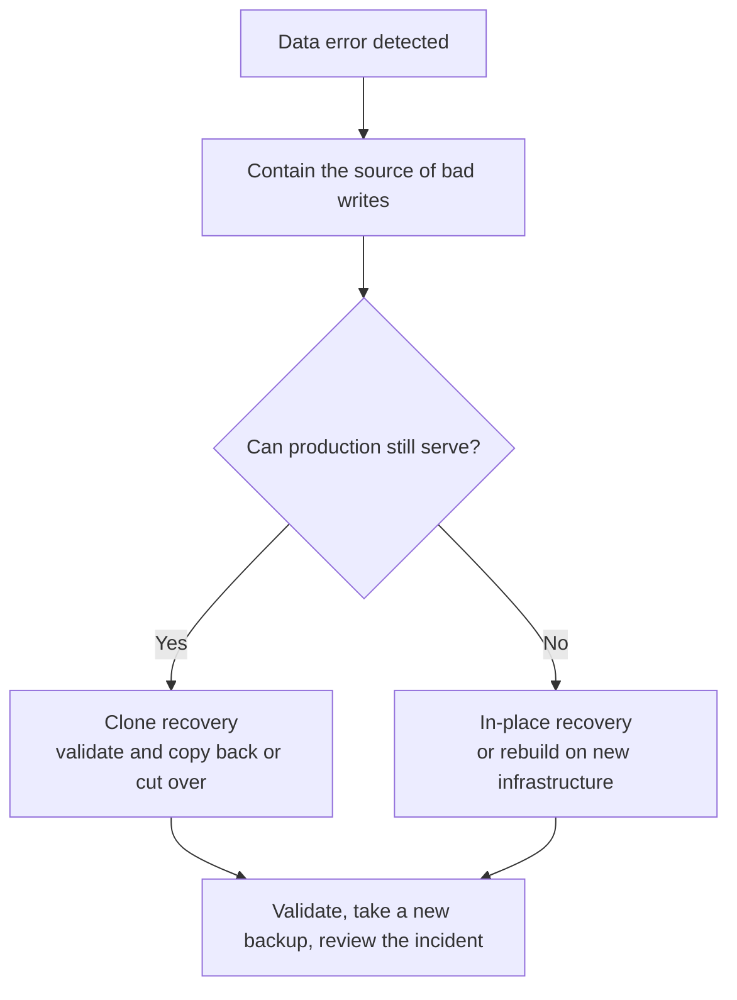

During an incident, the most expensive resource is often **decision time**. Pigsty can orchestrate the mechanical recovery steps, but an operator must still answer three questions: **what is the target, should recovery be in place or into a clone, and how will the result be validated?**

Read and rehearse this framework before an incident.


----------------

## Decision Framework

| Scenario | Typical problem | Recommended workflow | Target |
|:---------|:----------------|:---------------------|:-------|
| Accidental DML | `DELETE` or `UPDATE` affects the wrong rows | Clone, validate, then copy back data | `time` / `xid` |
| Dropped table, schema, or database | `DROP` or an incorrect migration | Clone, validate, then copy back objects | `time` / `name` |
| Defective release or batch corruption | Software writes incorrect data for a period | Clone and compare before choosing repair or cutover | `time` / `xid` |
| Audit, investigation, or forensics | Inspect historical state | Clone and hold at the target for inspection | `time` / `lsn` |
| Whole-cluster or site loss | Hosts or storage are gone or encrypted | Recover in place on replacement infrastructure | `default` / `time` |
{.full-width}

Two principles apply throughout:

* **Stop the damage first.** Pause the defective application or remove its write access before choosing a target. The window is moving, but a rushed restore to the wrong cluster can cause a second incident.
* **Prefer a clone while production is usable.** It leaves the source untouched, supports repeated target selection, and allows validation before export or cutover. It does overwrite the designated destination cluster. In-place recovery is appropriate when the whole cluster is unusable or the business has explicitly accepted rolling every database back.




----------------

## Accidental DML

A `DELETE` without `WHERE`, an incorrect `UPDATE`, or a defective batch job is the most common PITR use case.

First locate the error using application logs, PostgreSQL logs, metrics, or audit records. A timestamp is usually sufficient. If the exact transaction ID is known, `xid` plus `exclusive: true` can stop immediately before that transaction.

```bash
# If the deletion occurred around 10:15, clone the state from 10:14
./pgsql-pitr.yml -l pg-test -e '{"pg_pitr": { "cluster": "pg-meta", "time": "2026-07-11 10:14:00+08", "archive": false, "action": "promote" }}'

# If the deleting transaction was 250000, stop immediately before it
./pgsql-pitr.yml -l pg-test -e '{"pg_pitr": { "cluster": "pg-meta", "xid": "250000", "exclusive": true, "archive": false, "action": "promote" }}'
```

Validate the recovered rows, then copy only the required data back with `pg_dump`, `COPY`, or an application-specific reconciliation procedure. If a configured [**delayed cluster**](/docs/pgsql/config/cluster/#delayed-cluster) is still inside its delay window, reading from it may be faster than PITR.


----------------

## Dropped Objects

The same approach applies to `DROP TABLE`, `DROP DATABASE`, or a migration executed in the wrong environment, with an even stronger preference for a clone. Rolling the entire production cluster back to recover one object also discards every legitimate write after the target.

Restore a separate destination to before the DDL, validate the object, export it with `pg_dump`, and import it into production. For planned high-risk changes, create a named restore point with `pg_create_restore_point()` beforehand; a `name` target then removes timestamp ambiguity.


----------------

## Defective Release or Batch Corruption

When a faulty release corrupts data for hours, the challenge is usually identifying the last clean state and the full impact. A clone provides a clean comparison set. Restore repeatedly to candidate times, compare it with production, and decide whether to copy back corrected rows or cut over to a recovered cluster.

This decision needs application-owner validation: a successful PostgreSQL restore proves consistency at a target, not that the target represents correct business state.


----------------

## Audit and Investigation

Questions such as “what was this balance at month end?” require historical state. Restore into a separate destination, stop at a time, LSN, XID, or named restore point, and inspect without altering the source.

`action: pause` is the targeted-restore default and holds recovery at the target for inspection; it does **not** itself configure read-only access or create a separate cluster. The inventory limit and `cluster` source field determine the destination workflow. Run `-t down`, `-t pitr`, and `-t up` separately when you need an operator gate before promotion, and enforce read-only access explicitly if the investigation requires it. `immediate` means “stop at the first consistent point,” not “choose a historical timestamp.”


----------------

## Site Loss

If every database host is destroyed or encrypted, HA cannot help. Recovery requires a repository and the other control-plane assets to have survived **outside that failure domain**. That survivor can be Silo/S3, another protected host or filesystem, or another tested pgBackRest backend; a remote object store is recommended but the essential property is independent failure-domain survival.

Rebuild hosts, restore the declarative inventory, credentials, and PKI, point the cluster at the surviving repository, then restore through the end of archived WAL:

```bash
./pgsql-pitr.yml -l pg-meta -e '{"pg_pitr": {"action": "promote"}}'
```

Inventory and backup data are necessary but not sufficient. Preserve installation media or package repositories, repository credentials and encryption passwords, CA material, custom files, DNS dependencies, and an independently accessible runbook. Keep secrets encrypted and separate from both the database hosts and ordinary source control.


----------------

## Make Recovery a Routine Drill

The first end-to-end execution of any of these workflows should not occur during a production incident. Use a disposable destination to rehearse clone recovery regularly and after material architecture changes. Measure three outcomes:

1. **Usability:** can the backup and complete WAL chain be restored and validated?
2. **RTO:** how long does the actual restore and replay take now?
3. **Operator readiness:** can the on-call engineer identify source and destination, select a target, and follow the safety gates?

See [**Restore Operations**](/docs/pgsql/backup/restore/) and [**Clone a Database Cluster**](/docs/pgsql/backup/cluster/) for the task-level runbooks.
