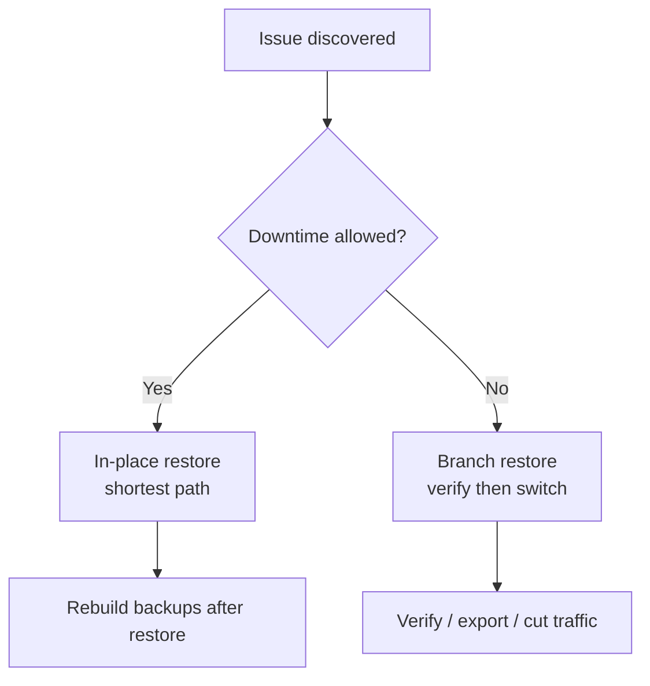
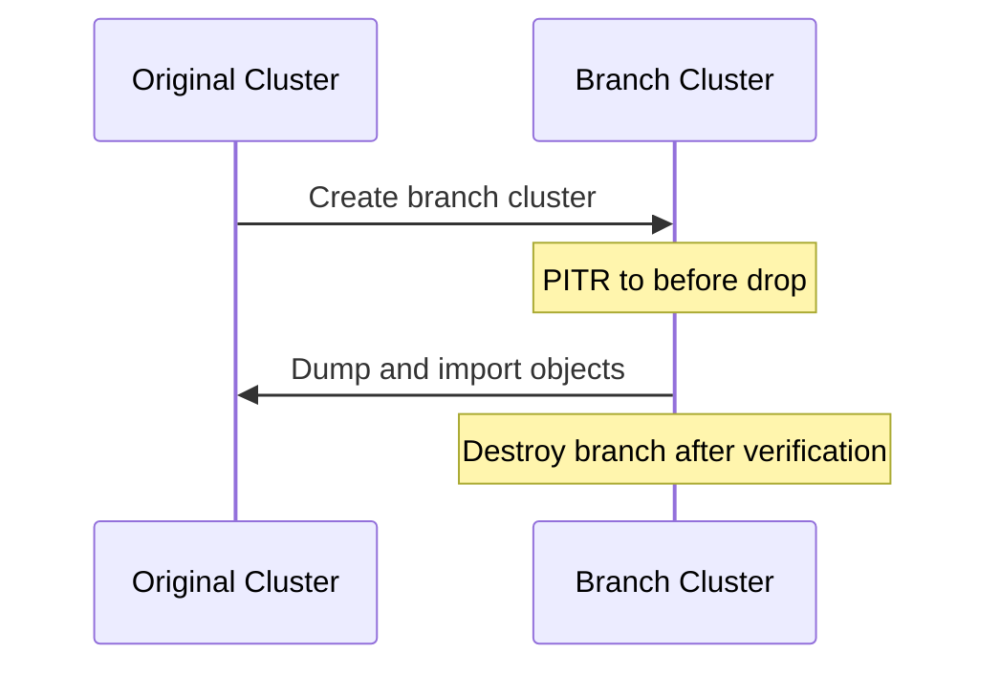

The value of PITR is not just “rolling back a database”, but **turning irreversible human/software mistakes into recoverable problems**.
It covers cases from “drop one table” to “entire site down”, addressing **logical errors and disaster recovery**.


--------

## Overview

PITR addresses these scenarios:

| Scenario Type | Typical Problem | Recommended Strategy | Recovery Target |
|:----------------------------|:-------------------------------------------------|:---------------------|:------------------|
| Accidental DML | `DELETE/UPDATE` without `WHERE`, script mistake | Branch restore first | `time` / `xid` |
| DDL drops | `DROP TABLE/DATABASE`, bad migration | Branch restore | `time` / `name` |
| Batch errors / bad release | Buggy release pollutes data | Branch restore + verify | `time` / `xid` |
| Audit / investigation | Need to inspect historical state | Branch restore (read-only) | `time` / `lsn` |
| Site disaster / total loss | Hardware failure, ransomware, power outage | In-place or rebuild | `latest` / `time` |
{.full-width}

### A Simple Rule of Thumb

- **If writes already caused business errors, consider PITR.**
- **Need online verification or partial recovery → branch restore.**
- **Need service restored ASAP → in-place restore** (accept downtime).




--------

## Scenario Details

### Accidental DML (Delete/Update)

**Typical issues**:

- `DELETE` without `WHERE`
- Bad `UPDATE` overwrites key fields
- Batch script bugs spread bad data

**Approach**:

1. **Stop the bleeding**: pause related apps or writes.
2. **Locate time point**: use logs/metrics/business feedback.
3. **Choose strategy**:
   - Downtime allowed: in-place restore before error
   - No downtime: branch restore, export correct data back

**Recommended targets**:

- Known transaction: `xid` + `exclusive: true`
- Time-based only: `time` + `exclusive: true`

```yaml
pg_pitr: { xid: "250000", exclusive: true }
# or
pg_pitr: { time: "2025-01-15 14:30:00+08", exclusive: true }
```


--------

### DDL Drops (Table/DB)

**Typical issues**:

- `DROP TABLE` / `DROP DATABASE`
- Wrong migration scripts
- Cleanup scripts deleted production objects

**Why branch restore**:

DDL is irreversible; **in-place restore rolls back the whole cluster**.
Branch restore lets you export only the dropped objects back, minimizing impact.

**Recommended flow**:

1. Create branch cluster and PITR to before drop
2. Validate schema/data
3. `pg_dump` target objects
4. Import back to production




--------

### Batch Errors / Bad Releases

**Typical issues**:

- Release writes incorrect data
- ETL/batch jobs pollute large datasets
- Fix scripts fail or scope unclear

**Principles**:

- **Prefer branch restore**: verify before cutover
- Compare data diff between original and branch

**Suggested flow**:

1. Determine error window
2. Branch restore to **before** error
3. Validate key tables
4. Export partial data or cut traffic

This scenario often needs business review, so branch restore is safer and controllable.


--------

### Audit / Investigation

**Typical issues**:

- Need to inspect historical data state
- Compare “correct history” with current data

**Recommended**: branch restore (read-only)

**Benefits**:

- No production impact
- Try multiple time points
- Fits audit, verification, forensics

```yaml
pg_pitr: { time: "2025-01-15 10:00:00+08" }  # create read-only branch
```


--------

### Site Disaster / Total Loss

This is the **ultimate PITR fallback**. When HA cannot help (primary + replicas down, power outage, ransomware), PITR is the last line of defense.

**Key prerequisite**:

> **Remote repo (MinIO/S3) is required.**

Local repo is lost together with the host, so recovery is impossible.

**Recovery flow**:

1. Prepare new hosts or new site
2. Restore cluster config and point to remote repo
3. Run PITR restore (usually `latest`)
4. Validate data and restore service

```bash
./pgsql-pitr.yml -l pg-meta   # restore to end of WAL archive
```


--------

## In-place vs Branch Restore

| Dimension | In-place Restore | Branch Restore |
|:---------------|:-----------------------------|:-----------------------------------|
| Downtime | Required | Not required |
| Risk | High (directly impacts prod) | Low (verify before action) |
| Complexity | Low | Medium (new cluster + export) |
| Recommended | Disaster recovery, fast restore | Mis-ops, audit, complex cases |
{.full-width}

For most production scenarios, **branch restore is the default recommendation**.
Only choose in-place restore when **service must be restored ASAP**.


--------

## Related Docs

- [**Restore Operations**](/docs/pgsql/backup/restore/)
- [**Backup Mechanism**](/docs/pgsql/backup/mechanism/)
- [**Backup Policy**](/docs/pgsql/backup/policy/)
