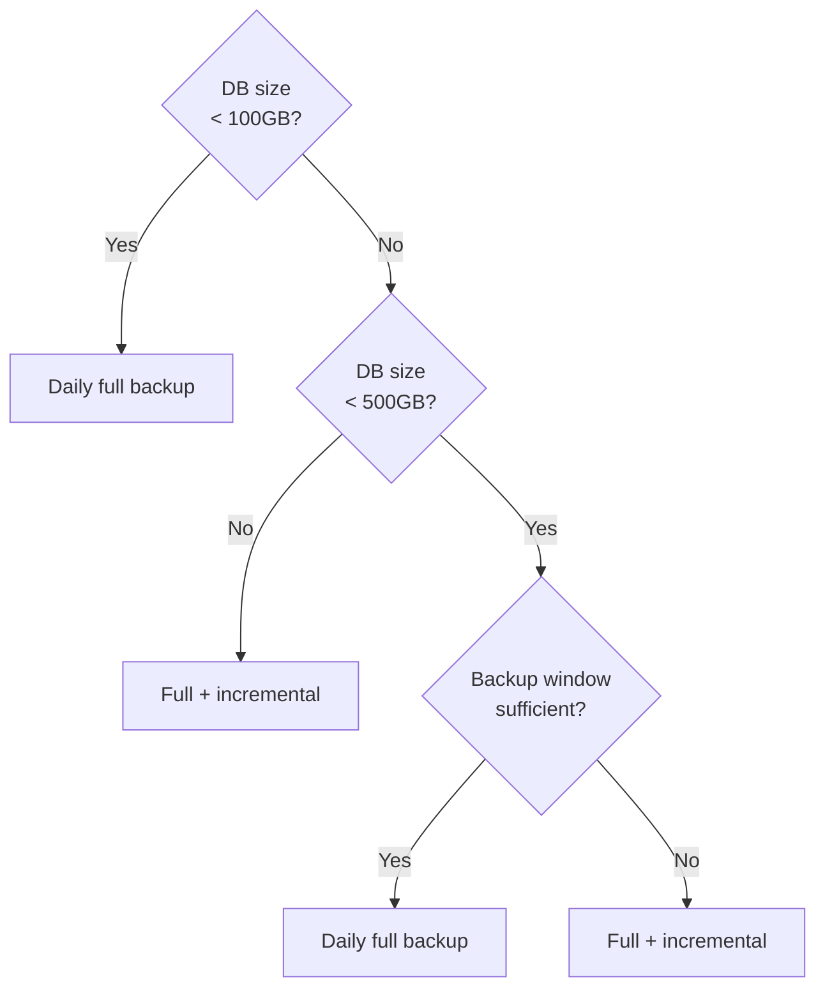

When designing a PITR strategy, the core tradeoffs are:
**backup repository location**, **recovery window length**, and **restore speed vs storage cost**.

This page helps you make practical choices across these dimensions.


--------

## Local vs Remote

Repository location is the first decision in PITR strategy.

### Local Repository

Store backups on primary local disk (`pgbackrest_method = local`):

**Pros**
- Simple, out-of-the-box
- Fast restore (local I/O)
- No external dependency

**Cons**
- No geo-DR; backups may be lost with host
- Limited by local disk capacity
- Same failure domain as production data

### Remote Repository

Store backups on MinIO / S3 (`pgbackrest_method = minio|s3`):

**Pros**
- Geo-DR, backups independent from DB host
- Near-unlimited capacity, shared by multiple clusters
- Works with encryption, versioning, and other safety controls

**Cons**
- Restore speed depends on network bandwidth
- Depends on object storage availability
- Higher deployment and ops cost

### How to Choose

| Scenario | Recommended Repo | Reason |
|:-------------|:--------------------|:-----------------------------|
| Dev/Test | local | Simple and sufficient |
| Single-node prod | minio / s3 | Recover even if host fails |
| Cluster prod | local + minio | Balance speed and DR |
| Critical business | multiple remote repos | Multi-site DR, maximum protection |
{.full-width}

See [**Backup Repository**](/docs/pgsql/backup/repository/) for details.


--------

## Space vs Window

Longer recovery window means more storage. Window length is defined by **backup retention + WAL retention**.

### Factors

| Factor | Impact |
|:-----------------|:-----------------------------------------------|
| **Database size** | Baseline for full backup size |
| **Change rate** | Affects incremental backups and WAL size |
| **Backup frequency** | Higher frequency = faster restore but more storage |
| **Retention** | Longer retention = longer window, more storage |
{.full-width}

### Intuitive Examples

Assume DB is 100GB, daily change 10GB:

**Daily full backups (keep 2)**


- Full backups: 100GB × 2 ≈ 200GB
- WAL archive: 10GB × 2 ≈ 20GB
- Total: ~2–3x DB size

**Weekly full + daily incremental (keep 14 days)**


- Full backups: 100GB × 2 ≈ 200GB
- Incremental: ~10GB × 12 ≈ 120GB
- WAL archive: 10GB × 14 ≈ 140GB
- Total: ~4–5x DB size

Space vs window is a hard constraint: you cannot get a longer window with less storage.


--------

## Strategy Choices

### Daily Full Backup

**Simplest and most reliable**, also the default for local repo:

- Full backup once per day
- Keep 2 full backups
- Recovery window about 24–48 hours

Suitable when:
- DB size is small to medium (< 500GB)
- Backup window is sufficient
- Storage cost is not a concern

### Full + Incremental

**Space-optimized strategy**, for large DBs or longer windows:

- Weekly full backup
- Incremental on other days
- Keep 14 days

Suitable when:
- Large DB size
- Using object storage
- Need 1–2 week recovery window




--------

## Recommended Configs

### Dev/Test

```yaml
pg_crontab:
  - '00 01 * * * /pg/bin/pg-backup full'
pgbackrest_method: local
```

- Window: 24–48 hours
- Characteristics: simplest and lowest cost

### Production Clusters

```yaml
pg_crontab:
  - '00 01 * * 1 /pg/bin/pg-backup full'
  - '00 01 * * 2,3,4,5,6,7 /pg/bin/pg-backup'
pgbackrest_method: minio
```

- Window: 7–14 days
- Characteristics: remote DR, production-ready

### Critical Business

**Dual-repo strategy** (local + remote):

```yaml
pgbackrest_method: local
pgbackrest_repo:
  local: { path: /pg/backup, retention_full: 2 }
  minio: { type: s3, retention_full_type: time, retention_full: 14 }
```

- Local repo for fast restore
- Remote repo for DR

See [**Backup Policy**](/docs/pgsql/backup/policy/) and [**Backup Repository**](/docs/pgsql/backup/repository/) for details.
