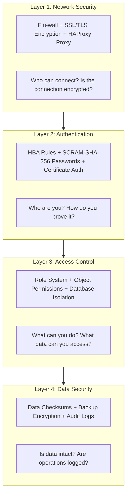
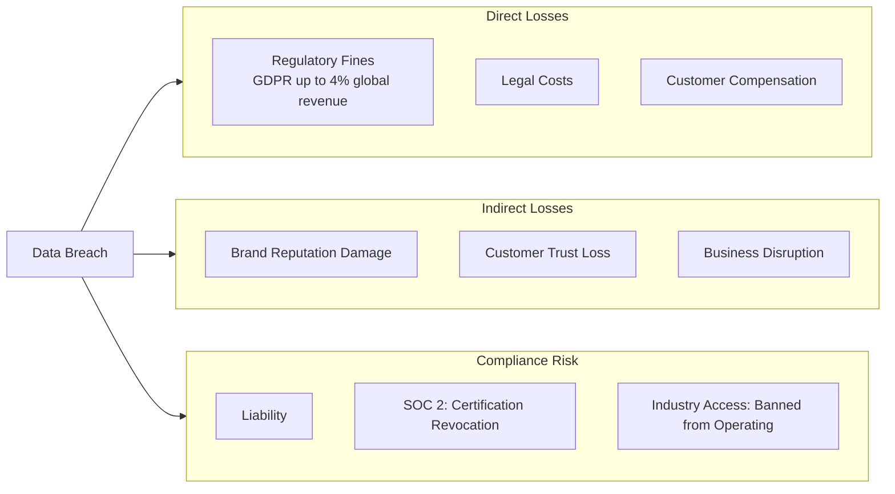
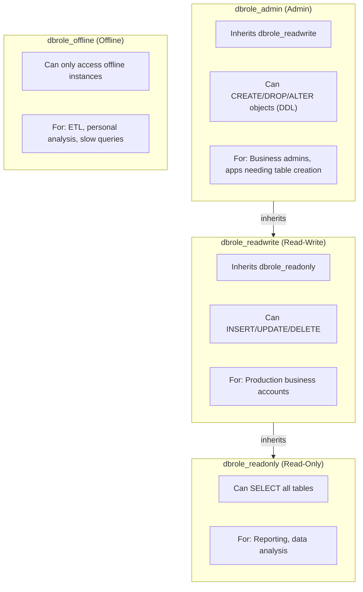
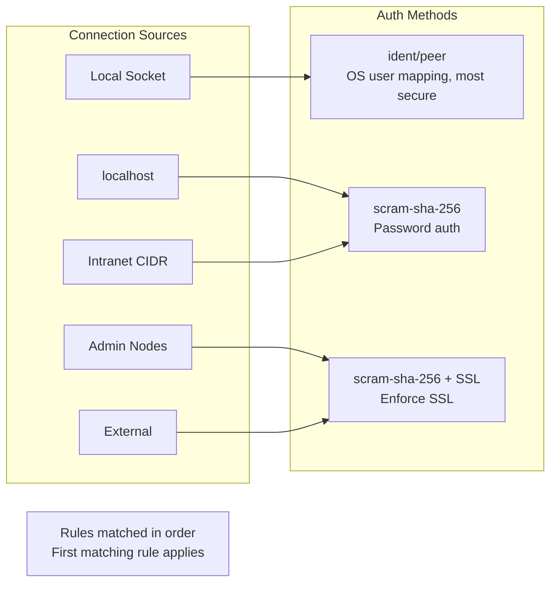
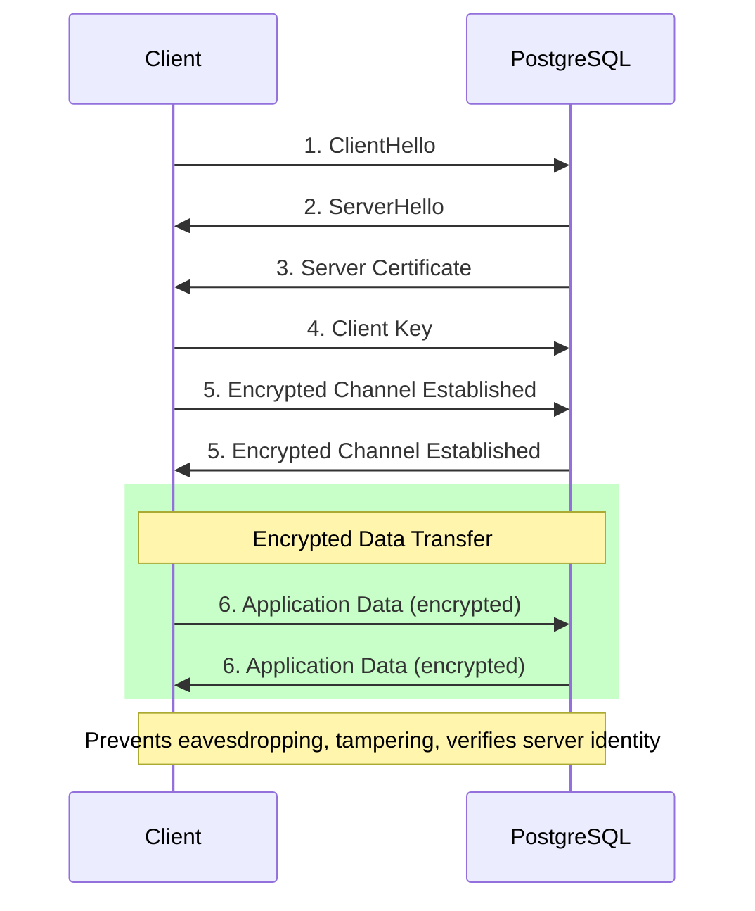

### Pigsty's Security Philosophy

**Secure by Default**: Out-of-the-box security configuration—basic protection without additional setup.

**Progressive Configuration**: Enterprise users can gradually enhance security measures through configuration.

**Defense in Depth**: Multiple security layers—even if one layer is breached, others remain protective.

**Least Privilege**: Grant users only the minimum permissions needed to complete tasks, reducing risk.


----------------

## Default Security Configuration

Pigsty enables these security features by default:

| Feature | Default Config | Description |
|:--------|:---------------|:------------|
| **Password Encryption** | `scram-sha-256` | PostgreSQL's most secure password hash algorithm |
| **SSL Support** | Enabled | Clients can optionally use SSL encrypted connections |
| **Local CA** | Auto-generated | Self-signed CA issues server certificates |
| **HBA Layering** | Source-based control | Different auth strength for different sources |
| **Role System** | Four-tier permissions | Read-only/Read-write/Admin/Offline |
| **Data Checksums** | Enabled | Detects storage-layer data corruption |
| **Audit Logs** | Enabled | Records connections and slow queries |

### Enhanced Configuration

Additional configuration enables higher security levels:

| Feature | Configuration Method | Security Level |
|:--------|:---------------------|:---------------|
| Password strength check | Enable `passwordcheck` extension | Enterprise |
| Enforce SSL | HBA uses `hostssl` | Enterprise |
| Client certificates | HBA uses `cert` auth | Financial-grade |
| Backup encryption | Configure `cipher_type` | Compliance |
| Firewall | Configure `node_firewall_mode` | Infrastructure |


If you only have one minute, remember this diagram:



**Core Value**: Enterprise-grade security configuration out of the box, best practices enabled by default, additional configuration achieves SOC 2 compliance.


----------------

## Contents

| Section | Description | Core Question |
|:--------|:------------|:--------------|
| **Security Overview** | Security capability overview and checklist | What's the overall security architecture? |
| [**Authentication**](/docs/pgsql/arch/sec) | HBA rules, password policies, certificate auth | How to verify user identity? |
| [**Access Control**](ac/) | Role system, permission model, database isolation | How to control user permissions? |
| [**Encrypted Communication**](ca/) | SSL/TLS, local CA, certificate management | How to protect data in transit? |
| **Compliance Checklist** | Detailed SOC2 mapping | How to meet compliance requirements? |


----------------

## Why Security Matters

### The Cost of Data Breaches




----------------

## Default Users and Passwords

Pigsty creates these system users by default:

| User | Purpose | Default Password | Post-Deploy Action |
|:-----|:--------|:-----------------|:-------------------|
| `postgres` | System superuser | No password (local only) | Keep passwordless |
| `dbuser_dba` | Admin user | `DBUser.DBA` | **Must change** |
| `dbuser_monitor` | Monitor user | `DBUser.Monitor` | **Must change** |
| `replicator` | Replication user | `DBUser.Replicator` | **Must change** |

```yaml
# pigsty.yml - Change default passwords
pg_admin_password: 'YourSecurePassword123!'
pg_monitor_password: 'AnotherSecurePass456!'
pg_replication_password: 'ReplicationPass789!'
```

**Important**: After production deployment, **immediately** change these default passwords!


----------------

## Role and Permission System

Pigsty provides a four-tier role system out of the box:



### Creating Business Users

```yaml
pg_users:
  # Read-only user - for reporting
  - name: dbuser_report
    password: ReportUser123
    roles: [dbrole_readonly]
    pgbouncer: true

  # Read-write user - for production
  - name: dbuser_app
    password: AppUser456
    roles: [dbrole_readwrite]
    pgbouncer: true

  # Admin user - for DDL operations
  - name: dbuser_admin
    password: AdminUser789
    roles: [dbrole_admin]
    pgbouncer: true
```


----------------

## HBA Access Control

HBA (Host-Based Authentication) controls "who can connect from where":



### Custom HBA Rules

```yaml
pg_hba_rules:
  # Allow app servers from intranet
  - {user: dbuser_app, db: mydb, addr: '10.10.10.0/24', auth: scram-sha-256}

  # Force SSL for certain users
  - {user: admin, db: all, addr: world, auth: ssl}

  # Require certificate auth (highest security)
  - {user: secure_user, db: all, addr: world, auth: cert}
```


----------------

## Encrypted Communication

### SSL/TLS Architecture



### Local CA

Pigsty automatically generates a local CA and issues certificates:

```
/etc/pki/
├── ca.crt              # CA certificate (public)
├── ca.key              # CA private key (keep secret!)
└── server.crt/key      # Server certificate/key
```

**Important**: Securely back up `ca.key`—if lost, all certificates must be reissued!


----------------

## Compliance Mapping

### SOC 2 Type II

| Control Point | Pigsty Support | Description |
|:--------------|:--------------:|:------------|
| CC6.1 Logical Access Control | Yes | HBA + Role System |
| CC6.6 Transmission Encryption | Yes | SSL/TLS |
| CC7.2 System Monitoring | Yes | Prometheus + Grafana |
| CC9.1 Business Continuity | Yes | HA + PITR |
| A1.2 Data Recovery | Yes | pgBackRest Backup |

**Legend**: Yes = Default satisfaction · Partial = Needs additional config


----------------

## Security Checklist

### Before Deployment

- [ ] Prepare strong passwords (use password manager)
- [ ] Plan network partitions (intranet/external CIDRs)
- [ ] Decide SSL strategy (self-signed/external CA)

### After Deployment (Required)

- [ ] **Change all default passwords**
- [ ] Verify HBA rules match expectations
- [ ] Test SSL connections work
- [ ] Configure auth failure alerts
- [ ] Securely back up CA private key

### Regular Maintenance

- [ ] Audit user permissions
- [ ] Check for expired accounts
- [ ] Update certificates (if needed)
- [ ] Review audit logs


----------------

## Quick Config Examples

### Production Security Configuration

```yaml
# pigsty.yml - Production security config example
all:
  vars:
    # Change default passwords (required!)
    pg_admin_password: 'SecureDBAPassword2024!'
    pg_monitor_password: 'SecureMonitorPass2024!'
    pg_replication_password: 'SecureReplPass2024!'

    # Enable password strength check
    pg_libs: 'passwordcheck, pg_stat_statements, auto_explain'

    # Custom HBA rules
    pg_hba_rules:
      # App servers
      - {user: app, db: appdb, addr: '10.10.10.0/24', auth: scram-sha-256}
      # Admin enforce SSL
      - {user: dbuser_dba, db: all, addr: world, auth: ssl}
```

### Financial-Grade Security Configuration

```yaml
# Financial-grade config - enable certificate auth
pg_hba_rules:
  # Trading system uses certificate auth
  - {user: trade_user, db: trade, addr: world, auth: cert}
  # Other systems use SSL + password
  - {user: all, db: all, addr: world, auth: ssl}

# Enable backup encryption
pgbackrest_repo:
  minio:
    cipher_type: aes-256-cbc
    cipher_pass: 'YourBackupEncryptionKey'
```


----------------

## Next Steps

Deep dive into security configuration details:

- **Security Overview**: Overall security architecture and checklist
- [**Authentication**](/docs/pgsql/arch/sec): HBA rules and password policies
- [**Access Control**](ac/): Role system and permission model
- [**Encrypted Communication**](ca/): SSL/TLS and certificate management
- **Compliance Checklist**: Detailed SOC2 mapping

Related topics:

- [**High Availability**](/docs/concept/ha/): Business continuity assurance
- [**Backup & Recovery**](/docs/concept/pitr/): Data recovery capabilities
- [**Observability**](/docs/concept/monitor): Security event monitoring

