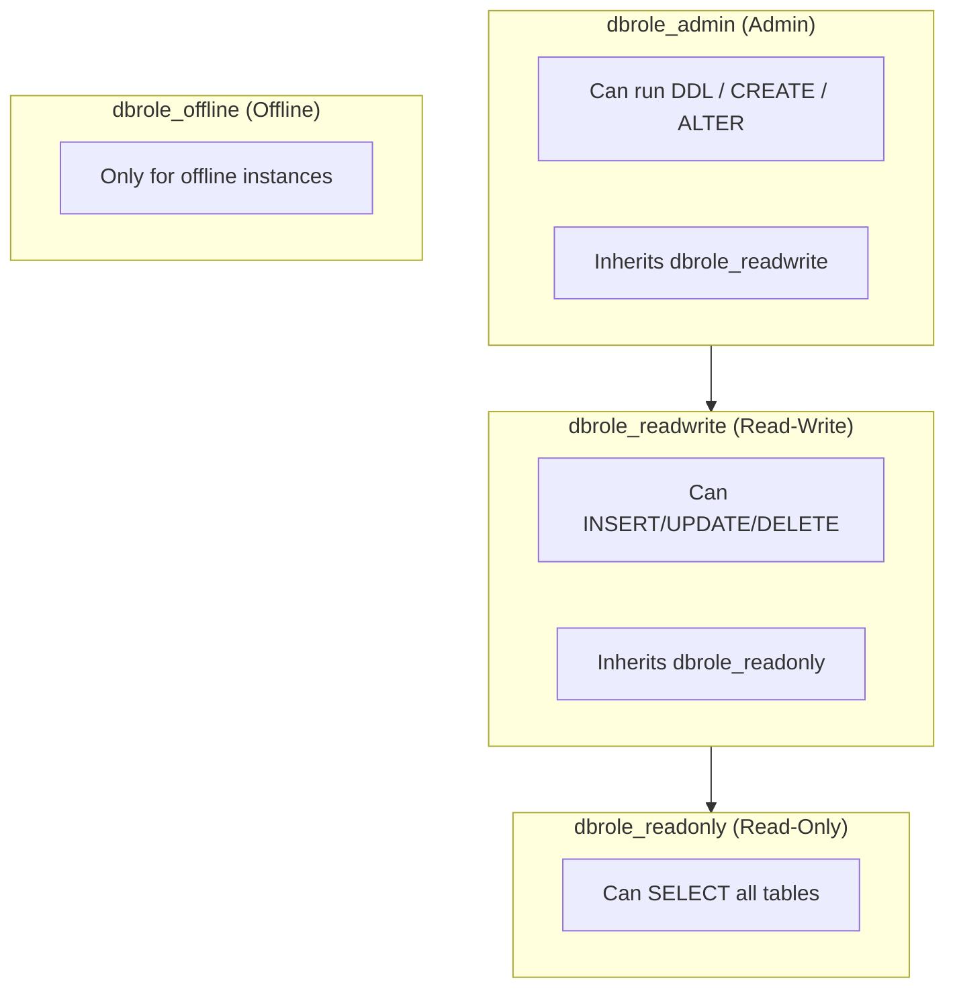

Access control answers two core questions:

- **What you can do**: boundaries for read/write/DDL
- **What data you can access**: isolation across databases and schemas

Pigsty enforces least privilege with **RBAC roles + default privileges**.


---------------------

## Four-Tier Role Model



**Problems solved**

- Production accounts have excessive permissions
- DDL and DML are not separated, increasing risk


---------------------

## Default Roles and System Users

Pigsty provides four roles and four system users (from default source values):

| Role/User | Attributes | Inherits/Roles | Description |
|---|---|---|---|
| `dbrole_readonly` | `NOLOGIN` | - | global read-only access |
| `dbrole_offline` | `NOLOGIN` | - | restricted read-only (offline instances) |
| `dbrole_readwrite` | `NOLOGIN` | `dbrole_readonly` | global read-write access |
| `dbrole_admin` | `NOLOGIN` | `pg_monitor, dbrole_readwrite` | admin / object creation |
| `postgres` | `SUPERUSER` | - | system superuser |
| `replicator` | `REPLICATION` | `pg_monitor, dbrole_readonly` | replication user |
| `dbuser_dba` | `SUPERUSER` | `dbrole_admin` | admin user |
| `dbuser_monitor` | - | `pg_monitor, dbrole_readonly` | monitor user |
{.full-width}

This default role set covers most use cases.


---------------------

## Default Privilege Policy

Pigsty writes default privileges (`pg_default_privileges`) during initialization so new objects automatically get reasonable permissions.

**Problems solved**

- New objects lack grants and apps fail
- Accidental grants to `PUBLIC` expose the whole DB

**Approach**

- Read-only role: `SELECT/EXECUTE`
- Read-write role: `INSERT/UPDATE/DELETE`
- Admin role: `DDL` privileges


---------------------

## Object Ownership and DDL Convention

Default privileges only apply to **objects created by admin roles**.

That means:

- Run DDL as `dbuser_dba` / `postgres`
- Or business admins `SET ROLE dbrole_admin` before DDL

Otherwise, new objects fall outside the default privilege system and break least privilege.


---------------------

## Database Isolation

Database-level isolation uses `revokeconn`:

```yaml
pg_databases:
  - { name: appdb, owner: dbuser_app, revokeconn: true }
```

**Problems solved**

- One account can "pierce" all databases
- Multi-tenant DBs lack boundaries


---------------------

## Public Privilege Tightening

Pigsty revokes `CREATE` on the `public` schema during init:

```
REVOKE CREATE ON SCHEMA public FROM PUBLIC;
```

**Problems solved**

- Unauthorized users create objects
- "Shadow tables/functions" security risks


---------------------

## Offline Role Usage

`dbrole_offline` can only access offline instances (`pg_role=offline` or `pg_offline_query=true`).

**Problems solved**

- ETL/analysis affects production performance
- Personal accounts run risky queries on primary


---------------------

## Best Practices

- Use `dbrole_readwrite` or `dbrole_readonly` for business accounts.
- Run production DDL via admin roles.
- Enable `revokeconn` for multi-tenant isolation.
- Use `dbrole_offline` for reporting/ETL.


---------------------

## Next

- 🔑 [**Authentication**](/docs/concept/sec/auth): HBA rules and password policy
- 🔐 [**Encrypted Communication**](/docs/concept/sec/ca): TLS and certificate management
- ✅ [**Compliance Checklist**](/docs/concept/sec/compliance): MLPS and SOC2 mapping
