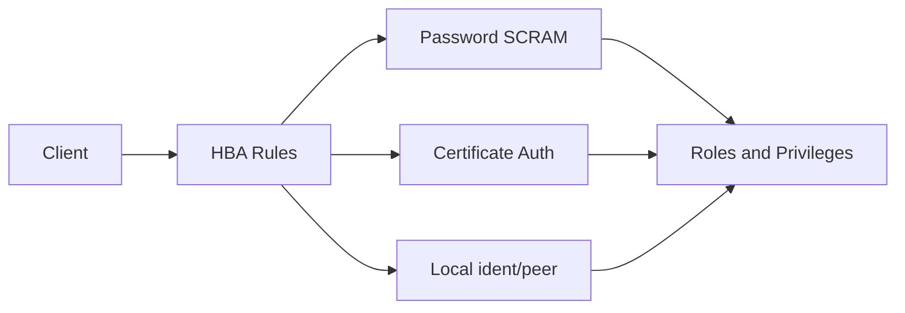

Authentication answers three core questions:

- **Who you are**: is the identity unique and recognizable?
- **How you prove it**: are passwords/certs strong enough?
- **Where you come from**: is the source controlled?

Pigsty uses **HBA rules + password/certificates** for authentication, with SCRAM as the default password hash.


---------------------

## Authentication Flow



HBA decides "**who can come from where**", and the auth method decides "**how identity is proven**".


---------------------

## HBA Layering Model

Pigsty default HBA rules are layered:

- **Local** uses `ident/peer`, the safest.
- **Intranet** uses `scram` password auth.
- **Internet admin** must use `ssl`.

This solves "**same user, different auth strength by source**".

**Key capabilities of HBA rules**

- **Order first**: supports `order` sorting, smaller number means higher priority.
- **Address aliases**: `local` / `localhost` / `intra` / `world`, etc.
- **Role conditions**: `primary/replica/offline` for fine-grained control.


---------------------

## Password Authentication

Default password hash:

```yaml
pg_pwd_enc: scram-sha-256
```

**Problems solved**

- Plaintext password storage risk
- Weak hashes cracked offline

**Compatibility**

For legacy clients you can use `md5`, but security is reduced.


---------------------

## Password Strength and Rotation

Pigsty can enable password strength checking extensions:

```yaml
pg_libs: '$libdir/passwordcheck, pg_stat_statements, auto_explain'
pg_extensions: [ passwordcheck, credcheck ]
```

Use `expire_in` to control account expiry:

```yaml
pg_users:
  - { name: dbuser_app, password: 'StrongPwd', expire_in: 365 }
```

**Problems solved**

- Weak or reused passwords
- Long-lived accounts without rotation


---------------------

## Certificate Authentication

Certificates mitigate the risk of "**password phishing or copying**".

- HBA `auth: cert` requires client certs.
- Certificate `CN` usually matches the database username.
- Pigsty ships `cert.yml` to issue client certificates.


---------------------

## PgBouncer Authentication

PgBouncer uses separate HBA rules and TLS settings:

```yaml
pgbouncer_sslmode: disable   # default off, set to require/verify-full
pgb_default_hba_rules: [...] # separate rules
```

This solves the problem of "**pool entry and database entry being out of sync**".


---------------------

## Default Accounts and Risks

| User | Default Password | Risk |
|---|---|---|
| `dbuser_dba` | `DBUser.DBA` | admin account default password |
| `dbuser_monitor` | `DBUser.Monitor` | monitor account can be abused |
| `replicator` | `DBUser.Replicator` | replication account abuse can leak data |
{.full-width}

Default passwords must be changed in production.


---------------------

## Security Recommendations

- Use `ssl/cert` on all public entry points.
- Use `scram` for intranet users, avoid `md5`.
- Enable `passwordcheck` to enforce complexity.
- Rotate passwords regularly (`expire_in`).


---------------------

## Next

- 👤 [**Access Control**](/docs/concept/sec/ac): role and privilege model
- 🔐 [**Encrypted Communication**](/docs/concept/sec/ca): TLS and certificate management
- ✅ [**Compliance Checklist**](/docs/concept/sec/compliance): MLPS and SOC2 mapping
