Security is not a wall, but a fortress. Pigsty adopts a **defense-in-depth** strategy, building multiple protections across seven layers. Even if one layer is breached, other layers still provide protection.


--------

## Overview


```
infographic sequence-pyramid-simple
data
  title Seven-Layer Security Model
  desc Pigsty Defense-in-Depth: Multi-layer protection from physical to user security
  items
    - label Physical Security
      value 100
      desc Data Checksums · PGTDE Transparent Encryption
      time L1
      icon mingcute/building-4-fill
      illus server-cluster
    - label Network Security
      value 95
      desc Firewall · SSL/TLS Encryption · Local CA
      time L2
      icon mingcute/earth-2-fill
      illus secure-server
    - label Perimeter Security
      value 90
      desc HAProxy Proxy · Nginx Gateway
      time L3
      icon mingcute/shield-fill
      illus firewall-protection
    - label Host Security
      value 85
      desc SELinux · Least Privilege · System Hardening
      time L4
      icon mingcute/computer-fill
      illus server-status
    - label Application Security
      value 80
      desc HBA Rules · Password Policy · Connection Pool
      time L5
      icon mingcute/safe-box-fill
      illus database-security
    - label Data Security
      value 75
      desc Backup Encryption · Audit Logs · PITR
      time L6
      icon mingcute/lock-fill
      illus data-encryption
    - label User Security
      value 70
      desc Four-Role Model · RBAC · Certificate Auth
      time L7
      icon mingcute/user-security-fill
      illus user-flow
theme light
  palette pigsty
```



--------

## Physical Security

> If physical access is compromised, other layers are rendered useless.

Physical security is the most basic layer, involving data center access control, surveillance, environmental control, equipment theft prevention, power protection, etc. As a software solution, Pigsty provides the following protection mechanisms at the physical layer:

### Data Checksums

Enabling data checksums can detect silent data corruption at the storage layer (e.g., bad disk blocks, memory errors, firmware bugs):

```yaml
pg_checksum: true  # Default enabled since v3.5+
```

**Principle**: PostgreSQL calculates checksums when writing each data page and validates when reading. Reports error instead of returning corrupt data when corruption is detected.

**Fallback mechanism**: Replica provides bad block fallback; damaged data pages on primary can be recovered from replica.

### Transparent Data Encryption

For compliance-required scenarios, use **PGTDE** (PostgreSQL Transparent Data Encryption) extension:

```yaml
pg_extensions:
  - pg_tde  # Transparent data encryption extension
```

**Effect**: Data is stored encrypted on disk; data cannot be read even if physical media is stolen.


--------

## Network Security

> Control access and filtering at the packet layer.

### Firewall

Pigsty supports node-level firewall configuration, controlling which ports are exposed:

```yaml
node_firewall_mode: zone       # off | none | zone
node_firewall_intranet:        # Intranet CIDR (trust zone)
  - 10.0.0.0/8
  - 172.16.0.0/12
  - 192.168.0.0/16
node_firewall_public_port:     # Public exposed ports
  - 22    # SSH
  - 80    # HTTP
  - 443   # HTTPS
```

**Three Modes**:

| Mode | Description | Use Case |
|:--|:--|:--|
| `off` | Don't configure firewall (default) | Dev environment, existing security groups |
| `none` | Disable firewalld | Using external firewall |
| `zone` | Zone mode: trust intranet, restrict public | Production recommended |

### SSL/TLS Encryption

Pigsty provides SSL/TLS encryption at multiple layers:

| Component | Parameter | Default | Description |
|:--|:--|:--|:--|
| PostgreSQL | HBA `auth` | `pwd` | Supports `ssl` (enforced), `cert` (certificate) |
| Pgbouncer | `pgbouncer_sslmode` | `disable` | Optional `require` / `verify-full` |
| Patroni | `patroni_ssl_enabled` | `false` | REST API encryption |
| Nginx | `nginx_sslmode` | `enable` | Optional `enforce` (force HTTPS) |
| MinIO | Enabled by default | enabled | Uses local CA certificate |
| etcd | Enabled by default | enabled | TLS encrypted communication |

**Security Hardening Configuration**:

```yaml
patroni_ssl_enabled: true    # Enable Patroni SSL
pgbouncer_sslmode: require   # Force Pgbouncer SSL
nginx_sslmode: enforce       # Force HTTPS
```

### Local CA Certificate Infrastructure

Pigsty automatically generates a local CA and issues certificates, no commercial certificates needed:

```
files/pki/ca/
├── ca.crt              # CA certificate (public, distributed to all nodes)
└── ca.key              # CA private key (⚠️ Keep secret! Backup securely!)

/etc/pki/               # Certificate directory on nodes
├── ca.crt              # CA certificate
├── server.crt          # Server certificate
└── server.key          # Server private key
```

**⚠️ Important**: Please securely backup `ca.key`. If lost, all certificates need to be re-issued!


--------

## Perimeter Security

> Handle security policies at internal/external network boundaries.

### HAProxy Security

HAProxy serves as the unified entry point for database traffic, providing these security features:

```yaml
haproxy_admin_password: 'StrongPassword123'  # Admin interface password
```

**Security Features**:
- Health checks and traffic control to prevent split-brain
- Connection limits and rate limiting
- Admin interface password protection

### Nginx Security

Nginx serves as the unified gateway for web services, providing:

```yaml
nginx_sslmode: enforce  # Force HTTPS
infra_portal:           # Configure component domains
  grafana: { domain: g.pigsty.io }
  alertmanager: { domain: a.pigsty.io }
```

**Security Features**:
- Unified HTTPS entry, easy to audit
- Reverse proxy protects backend services
- Can integrate external authentication (OAuth, LDAP)


--------

## Host Security

> OS hardening, patch management, minimal installation.

### SELinux Configuration

Pigsty correctly configures SELinux policies to ensure PostgreSQL and other services run properly:

```yaml
node_selinux_mode: permissive  # disabled | permissive | enforcing
```

| Mode | Description | Use Case |
|:--|:--|:--|
| `disabled` | Completely disabled | Dev environment |
| `permissive` | Permissive mode (log but don't block) | Production recommended |
| `enforcing` | Enforcing mode | High security environments |

### OS Hardening

Pigsty follows the principle of least privilege in design:

- **File permissions**: Sensitive files (e.g., CA private key) have strictly controlled permissions
- **User groups**: PostgreSQL, etcd, etc. run with dedicated users
- **Admin configuration**:

```yaml
node_admin_username: dba        # Admin username
node_admin_sudo: nopasswd       # sudo policy
```

### System Updates

Keep critical security components updated:
- `openssh`: SSH service
- `ca-certificates`: System root certificates
- `openssl`: Encryption library


--------

## Application Security

> Database configuration, authentication/authorization, input validation.

### Password Policy

#### Password Encryption Algorithm

```yaml
pg_pwd_enc: scram-sha-256  # Most secure password hash algorithm
```

| Algorithm | Security | Compatibility | Description |
|:--|:--|:--|:--|
| `scram-sha-256` | ⭐⭐⭐ | PostgreSQL 10+ | Recommended, default |
| `md5` | ⭐ | All versions | Only for legacy clients |

#### Password Strength Check

Enable `passwordcheck` extension to enforce password complexity:

```yaml
pg_libs: '$libdir/passwordcheck, pg_stat_statements, auto_explain'
pg_extensions:
  - passwordcheck  # Enforce password complexity
  - credcheck      # Additional password checks
```

#### Password Expiration

```yaml
pg_users:
  - { name: dbuser_app, password: 'SecurePass123', expire_in: 365 }  # Expires in 1 year
```

### HBA Rules

HBA (Host-Based Authentication) controls "who can connect from where, using what authentication method":

```yaml
pg_default_hba_rules:
  - {user: '${dbsu}'     ,db: all         ,addr: local     ,auth: ident ,title: 'dbsu local via ident'}
  - {user: '${dbsu}'     ,db: replication ,addr: local     ,auth: ident ,title: 'dbsu repl via ident'}
  - {user: '${repl}'     ,db: replication ,addr: localhost ,auth: pwd   ,title: 'repl via localhost'}
  - {user: '${repl}'     ,db: replication ,addr: intra     ,auth: pwd   ,title: 'repl from intranet'}
  - {user: '${repl}'     ,db: postgres    ,addr: intra     ,auth: pwd   ,title: 'repl from intranet'}
  - {user: '${monitor}'  ,db: all         ,addr: localhost ,auth: pwd   ,title: 'monitor via localhost'}
  - {user: '${monitor}'  ,db: all         ,addr: infra     ,auth: pwd   ,title: 'monitor from infra'}
  - {user: '${admin}'    ,db: all         ,addr: infra     ,auth: ssl   ,title: 'admin from infra'}
  - {user: '${admin}'    ,db: all         ,addr: world     ,auth: ssl   ,title: 'admin from world'}
  - {user: '+dbrole_readonly',db: all     ,addr: localhost ,auth: pwd   ,title: 'read from localhost'}
  - {user: '+dbrole_readonly',db: all     ,addr: intra     ,auth: pwd   ,title: 'read from intranet'}
  - {user: '+dbrole_offline' ,db: all     ,addr: intra     ,auth: pwd   ,title: 'offline from intranet'}
```

**Authentication Methods**:

| Alias | Description | Security Level |
|:--|:--|:--|
| `ident/peer` | OS user mapping | ⭐⭐⭐ Local only |
| `pwd` | Password auth (scram-sha-256) | ⭐⭐ |
| `ssl` | Forced SSL + password | ⭐⭐⭐ |
| `cert` | Client certificate auth | ⭐⭐⭐⭐ Highest |
| `deny` | Deny access | - |

### Listen Address

Limit network interfaces PostgreSQL listens on:

```yaml
pg_listen: '${ip},${vip},${lo}'  # Only listen on specific IPs, not 0.0.0.0
```


--------

## Data Security

> Encryption, backup, audit, integrity protection.

### Backup Encryption

pgBackRest supports AES-256 encrypted backups:

```yaml
pgbackrest_repo:
  minio:
    cipher_type: aes-256-cbc           # AES-256-CBC encryption
    cipher_pass: 'pgBR.${pg_cluster}'  # Use cluster name as part of password
```

**Effect**: Backup files are stored encrypted; data cannot be read even if storage is compromised.

### Audit Logs

#### PostgreSQL Audit Extensions

```yaml
pg_extensions:
  - pgaudit           # SQL audit logs
  - pgauditlogtofile  # Audit logs to file
  - pg_auth_mon       # Authentication monitoring
  - pg_auditor        # Audit helper
```

#### Connection Logs

```yaml
# Configure in pg_parameters
log_connections: on        # Log connection establishment
log_disconnections: on     # Log connection termination
```

#### Slow Query Logs

```yaml
log_min_duration_statement: 1000  # Log queries >1s
```

### Point-in-Time Recovery (PITR)

Pigsty configures pgBackRest for PITR by default:

```yaml
pgbackrest_enabled: true
pgbackrest_repo:
  local:                           # Local backup
    path: /pg/backup
    retention_full: 2
  minio:                           # Remote backup
    path: /pgbackrest
    retention_full_type: time
    retention_full: 14             # Retain 14 days
```


--------

## User Security

> Identity authentication, permission management, behavior audit.

### Four-Role Model

Pigsty provides out-of-box four-tier permission roles:

```mermaid
flowchart TB
    subgraph Admin["🔴 dbrole_admin (Administrator)"]
        A1["Inherits dbrole_readwrite"]
        A2["Can CREATE/DROP/ALTER (DDL)"]
        A3["Use case: Business admins, schema-creating apps"]
    end
    subgraph RW["🟡 dbrole_readwrite (Read-Write)"]
        RW1["Inherits dbrole_readonly"]
        RW2["Can INSERT/UPDATE/DELETE"]
        RW3["Use case: Production business accounts"]
    end
    subgraph RO["🟢 dbrole_readonly (Read-Only)"]
        RO1["Can SELECT all tables"]
        RO2["Use case: Reporting, data analysis"]
    end
    subgraph Offline["🔵 dbrole_offline (Offline)"]
        OFF1["Can only access offline instances"]
        OFF2["Use case: ETL, slow queries, personal analysis"]
    end

    Admin --> |inherits| RW
    RW --> |inherits| RO
```



**Creating Business Users**:

```yaml
pg_users:
  - { name: dbuser_report, password: 'ReportPass123', roles: [dbrole_readonly] }
  - { name: dbuser_app, password: 'AppPass456', roles: [dbrole_readwrite] }
  - { name: dbuser_admin, password: 'AdminPass789', roles: [dbrole_admin] }
```

### Default Users and Passwords

| User | Default Password | Purpose | Post-Deploy Action |
|:--|:--|:--|:--|
| `postgres` | No password (local only) | System superuser | Keep without password |
| `dbuser_dba` | `DBUser.DBA` | Admin user | **Must change** |
| `dbuser_monitor` | `DBUser.Monitor` | Monitor user | **Must change** |
| `replicator` | `DBUser.Replicator` | Replication user | **Must change** |

**Auto-Generate Strong Passwords**:

```bash
./configure -g  # Automatically generate random strong passwords
```

### Certificate Authentication

Highest security level, requires clients to provide valid certificates:

```yaml
pg_hba_rules:
  - {user: admin, db: all, addr: world, auth: cert}  # Admin uses cert auth
```

### ETCD and MinIO Security

Auxiliary components also use RBAC model and TLS encryption:

```yaml
# ETCD
etcd_root_password: 'Etcd.Root.Strong'  # Must change

# MinIO
minio_access_key: minioadmin
minio_secret_key: 'S3User.MinIO.Strong'  # Must change
minio_users:
  - { access_key: pgbackrest, secret_key: 'Min10.bAckup', policy: readwrite }
  - { access_key: dba, secret_key: 'S3User.DBA.Strong', policy: consoleAdmin }
```

### Watchdog Protection

Prevents split-brain, ensures primary forced shutdown during failover:

```yaml
patroni_watchdog_mode: required  # off | automatic | required
```

**Effect**: When Patroni process is abnormal, watchdog forces node restart to avoid dual-primary split-brain.


--------

## Compliance Mapping

### China MLPS Level 3 (GB/T 22239-2019)

| Requirement | Default | Configurable | Implementation |
|:------------|:-------:|:------------:|:---------------|
| Unique Identity | ✅ | ✅ | Unique username identifier |
| Password Complexity | ⚠️ | ✅ | `passwordcheck` extension |
| Password Rotation | ⚠️ | ✅ | `expire_in` attribute |
| Two-Factor Auth | ⚠️ | ✅ | Certificate + password (`auth: cert`) |
| Access Control | ✅ | ✅ | HBA + Four-role model |
| Least Privilege | ✅ | ✅ | `dbrole_readonly/readwrite/admin` |
| Encrypted Communication | ✅ | ✅ | SSL/TLS |
| Audit Logs | ✅ | ✅ | `pgaudit` + connection logs |
| Data Integrity | ✅ | ✅ | `pg_checksum: true` |
| Backup & Recovery | ✅ | ✅ | pgBackRest + PITR |
{.full-width}

### SOC 2 Type II

| Control Point | Pigsty Support | Implementation |
|:--------------|:--------------:|:---------------|
| CC6.1 Logical Access Control | ✅ | HBA + RBAC |
| CC6.6 Transmission Encryption | ✅ | SSL/TLS (can enforce) |
| CC7.2 System Monitoring | ✅ | Prometheus + Grafana |
| CC9.1 Business Continuity | ✅ | HA + PITR |
| A1.2 Data Recovery | ✅ | pgBackRest backup |
{.full-width}

**Legend**: ✅ Default satisfied · ⚠️ Requires additional configuration


--------

## Security Checklist

### Pre-Deployment

- [ ] Prepare strong passwords (use `./configure -g` to auto-generate)
- [ ] Plan network partitioning (intranet/public CIDR)
- [ ] Determine SSL policy (self-signed CA or external CA)
- [ ] Determine whether to enable firewall

### Post-Deployment (Required)

- [ ] **Change all default passwords**
- [ ] Verify HBA rules meet expectations
- [ ] Test SSL connections work properly
- [ ] Configure authentication failure alerts
- [ ] Securely backup CA private key

### Security Enhancement (Optional)

- [ ] Enable `passwordcheck` extension
- [ ] Force SSL (`pgbouncer_sslmode: require`)
- [ ] Enable certificate authentication (`auth: cert`)
- [ ] Enable `pgaudit` audit logs
- [ ] Enable backup encryption
- [ ] Enable Patroni SSL
- [ ] Enable watchdog
- [ ] Configure firewall rules
- [ ] Enable SELinux enforcing mode


--------

## What's Next

Deep dive into security configuration details:

- 👤 [**Access Control**](ac/): Role system and permission model
- 🔐 [**Encrypted Communication**](ca/): SSL/TLS and certificate management

Related topics:

- ♾️ [**High Availability**](../ha/): Business continuity assurance
- ⏰ [**Backup & Recovery**](../pitr/): Data recovery capabilities


