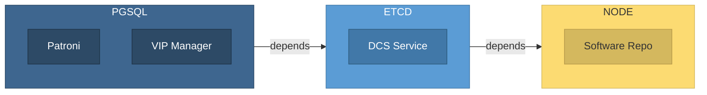

ETCD is a distributed, reliable key-value store for critical system config data.

Pigsty uses [**etcd**](https://etcd.io/) as [**DCS**](https://patroni.readthedocs.io/en/latest/dcs_failsafe_mode.html) (Distributed Config Store), critical for PostgreSQL HA and automatic failover.

The [`ETCD`](/docs/etcd) module depends on [`NODE`](/docs/node) module and is required by [`PGSQL`](/docs/pgsql) module. Install [`NODE`](/docs/node) module to manage nodes before installing [`ETCD`](/docs/etcd).

Deploy [`ETCD`](/docs/etcd) cluster before any [`PGSQL`](/docs/pgsql) cluster—`patroni` and `vip-manager` for PG HA rely on etcd for HA and L2 VIP binding to primary.

One etcd cluster per Pigsty deployment serves multiple PG clusters.

Pigsty enables RBAC by default. Each PG cluster uses independent credentials for multi-tenant isolation. Admins use etcd root user with full permissions over all PG clusters.

