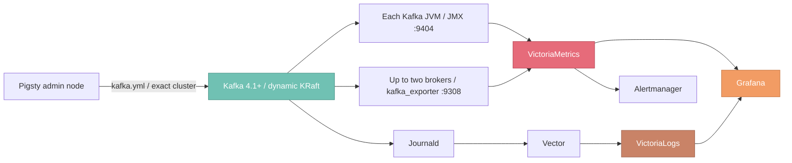

[Kafka](https://kafka.apache.org/) is a distributed event-streaming platform. Pigsty's [`KAFKA`](/docs/kafka) module deploys **Apache Kafka 4.1+ dynamic KRaft** clusters on managed nodes from RPM/DEB packages, with unified management of security, resources, lifecycle, and observability.

{}
The Kafka module is currently in Beta. Test it thoroughly and confirm it meets your requirements before using it in serious production.
That includes dynamic KRaft, strict rolling restart, TLS/SCRAM/ACL, declarative topics/users, credential and certificate rotation, and the full monitoring pipeline.
{}

--------

## Module Capabilities

The KAFKA module currently provides:

- Native dynamic KRaft: no ZooKeeper installed, and no static `controller.quorum.voters` rendered
- Three native roles `combined` / `broker` / `controller`, in both combined and separated control-plane/data-plane topologies
- New clusters get a random Cluster ID and Controller Directory IDs, frozen by a minimal bootstrap manifest that fails closed on conflict
- Automatic path selection from live health: cold start/repair, serial broker admission, dynamic controller join, or strict single-node rolling restart
- Checks before and after each rolling step for controller majority and voter catch-up, offline partitions, under-min-ISR, and ISR catch-up
- Playbook-orchestrated member retirement and failed-node replacement: `kafka-rm.yml` strict-subset retirement (dead nodes included), three commands to replace a node
- Two security profiles, `plaintext` and the production `scram` (TLS, SCRAM-SHA-512, controller mTLS, ACLs, and default-deny authorization)
- Declarative convergence of topics, user credentials, ACLs, and quotas without implicit deletion; protected rotation for internal credentials and certificates
- Full observability: JMX and protocol exporters, 19 recording rules, 15 alert rules, 4 Grafana dashboards, and logs in VictoriaLogs

--------

## Module Architecture

The KAFKA module depends on [`NODE`](/docs/node) for node management, the package repository, and base monitoring, and on [`INFRA`](/docs/infra) for VictoriaMetrics, VictoriaLogs, Grafana, and Alertmanager.

Every Kafka JVM has a JMX Exporter injected and is registered as `job=kafka`. The protocol-level `kafka_exporter` runs only on the first two broker-capable nodes ordered by `kafka_seq`; a single-broker cluster runs only one, and pure controllers run none. They return the same logical-cluster view, so recording rules deduplicate before aggregating.

--------

## Documentation

| Document                             | Contents                                                              |
|:-----------------------------------|:--------------------------------------------------------------------|
| [Quickstart](/docs/kafka/start)    | From a single node to a three-node secure cluster: client access, parameter changes, and go-live checks |
| [Cluster Config](/docs/kafka/config)   | Topology, dynamic KRaft, network, storage, security, and resource declarations |
| [Parameters](/docs/kafka/param)    | 15 persistent public parameters plus transient operational variables |
| [Administration](/docs/kafka/admin)    | Status checks, topics, messages, consumer groups, and topology changes |
| [Playbook](/docs/kafka/playbook) | `kafka.yml` lifecycle, task tags, rotation, and teardown safeguards |
| [Monitoring](/docs/kafka/monitor)  | Metrics pipeline, dashboards, log queries, and alert rules |
| [Metrics](/docs/kafka/metric)   | Metric dictionary for JMX, the protocol exporter, and recording rules |
| [FAQ](/docs/kafka/faq)      | Questions on roles, identity, security, exporters, and scaling |
{.full-width}

--------

## First Time

The [Quickstart](/docs/kafka/start) offers a complete path from scratch, building up step by step: single-node development cluster → three-node TLS/SCRAM/ACL secure cluster → application client access → parameter and resource changes → go-live checks.

If you are already familiar with Kafka and Pigsty, jump straight to [Cluster Config](/docs/kafka/config) or [Parameters](/docs/kafka/param).

--------

## Default Ports

|  Port  | Service          | Deployment scope        | `plaintext` | `scram`                  |
|:------:|:-----------------|:-----------------------|:------------|:-------------------------|
| `9092` | Kafka Broker     | Broker-capable nodes    | PLAINTEXT   | SASL_SSL + SCRAM-SHA-512 |
| `9093` | KRaft Controller | Controller-capable nodes | PLAINTEXT   | Mutual TLS               |
| `9308` | kafka_exporter   | Up to two broker-capable nodes | HTTP metrics | HTTP metrics, TLS/SCRAM on the backend |
| `9404` | JMX Exporter     | All Kafka nodes         | HTTP metrics | HTTP metrics             |
{.full-width}

All four ports must differ from one another, and all are adjustable via parameters. The HTTP ports of the JMX and protocol exporters should still be restricted to the monitoring network by firewall.

--------

## Current Boundaries

The current role provides a core deployment baseline for Kafka, not a replacement for a full streaming platform or a managed service. The following capabilities still require an explicit runbook or a separate component:

- Reassignment of existing partitions after broker scale-out and replica rebalancing (member join/retirement/replacement is orchestrated by the playbooks; data movement still needs an explicit plan)
- Raising the frozen `default.replication.factor` after scale-out: Kafka 4.3 requires an explicit data-migration and static-config maintenance window
- Changing the replication factor of an existing topic, deleting topics, and deleting users
- Online migration of a formatted cluster from `plaintext` to `scram`
- Kafka version upgrades, feature-level finalization, data backup, restore, and disaster drills
- Multiple listeners, NAT/public addresses, multi-client networks on the same broker, and tiered storage
- Kafka Connect, Schema Registry, MirrorMaker 2, Cruise Control, and web UIs

These boundaries should be documented explicitly in your production plan, approval process, and drills; they cannot be substituted by rerunning an ordinary inventory.
