Pigsty's PostgreSQL clusters come with an out-of-the-box high availability solution, powered by [**Patroni**](https://patroni.readthedocs.io/en/latest/), [**Etcd**](https://etcd.io/), and [**HAProxy**](http://www.haproxy.org/).

When your PostgreSQL cluster contains two or more instances, you gain hardware failure self-healing database high availability capability without any configuration — as long as any instance in the cluster is alive, the cluster can provide complete service to the outside world. Clients only need to connect to any node in the cluster to obtain complete service without worrying about primary-replica topology changes.

With default configuration, the primary failure Recovery Time Objective (RTO) ≈ 30s, Recovery Point Objective (RPO) < 1MB; replica failure RPO = 0, RTO ≈ 0 (brief interruption); in consistency-first mode, zero data loss during failover can be ensured: RPO = 0. All these metrics can be [**configured on-demand**](#trade-offs) according to your actual hardware conditions and reliability requirements.

Pigsty has built-in HAProxy load balancer for automatic traffic switching, providing various access methods such as DNS/VIP/LVS for clients to choose from. Failover and switchover are almost imperceptible to the business side except for occasional brief interruptions, and applications do not need to modify connection strings and restart.
The minimal maintenance window requirement brings great flexibility and convenience: you can perform rolling maintenance and upgrades of the entire cluster without application cooperation. The feature that hardware failures can be handled the next day allows developers, operations, and DBAs to sleep soundly during failures.

Many large organizations and core institutions have been using Pigsty in production environments for a long time. The largest deployment has 25K CPU cores and 220+ PostgreSQL extra-large instances (64c / 512g / 3TB NVMe SSD); in this deployment case, dozens of hardware failures and various incidents occurred within five years, but it still maintained an overall availability record of more than **99.999%**.


-----------------

## Architecture Overview

Pigsty's high availability architecture consists of four core components that work together to achieve automatic failure detection, leader election, and traffic switching:


-----------------

## Component Details

### PostgreSQL

PostgreSQL is the core database service, using standard **Streaming Replication** to build physical replicas:

- **Primary**: Accepts read-write requests, generates WAL logs
- **Replica**: Receives WAL in real-time through streaming replication, provides read-only queries
- **Replication Slot**: Ensures WAL is not cleaned up prematurely
- **Synchronous Commit**: Optional synchronous replication mode, ensuring RPO = 0

Key configuration (dynamically managed by Patroni):

```yaml
wal_level: logical                    # Enable logical replication level
max_wal_senders: 50                   # Maximum WAL sender processes
max_replication_slots: 50             # Maximum replication slots
hot_standby: on                       # Replica readable
wal_log_hints: on                     # Support pg_rewind
track_commit_timestamp: on            # Track transaction timestamps
synchronous_standby_names: ''         # Synchronous standby list (dynamically managed)
```

-----------------

### Patroni

[Patroni](https://patroni.readthedocs.io/) is the core engine of high availability, responsible for managing PostgreSQL lifecycle and cluster state:

**Core Responsibilities**:
- Manage PostgreSQL process start/stop and configuration
- Maintain leader lease
- Execute automatic failover and switchover
- Provide REST API for health checks and cluster management
- Handle replica auto-rebuild and `pg_rewind`

**Key Timing Parameters** (controlling RTO):

| Parameter | Default | Description |
|:-----|:------:|:-----|
| `ttl` | 30s | Leader lease validity period, i.e., failure detection time window |
| `loop_wait` | 10s | Patroni main loop interval |
| `retry_timeout` | 10s | DCS and PostgreSQL operation retry timeout |
| `primary_start_timeout` | 10s | Primary startup timeout |
| `primary_stop_timeout` | 30s | Primary graceful stop timeout (effective in sync mode) |

These parameters are uniformly calculated and derived by [`pg_rto`](/docs/pgsql/param#pg_rto). The default 30s RTO corresponds to:

```yaml
ttl: 30                               # Leader lease TTL
loop_wait: 10                         # Main loop interval = RTO/3
retry_timeout: 10                     # Retry timeout = RTO/3
primary_start_timeout: 10             # Primary start timeout = RTO/3
```

**Constraint**: `ttl >= loop_wait + retry_timeout * 2`

**Health Check Endpoints** (used by HAProxy):

| Endpoint | Purpose | Return 200 Condition |
|:-----|:-----|:-------------|
| `/primary` | Primary service | Current node is Leader |
| `/replica` | Replica service | Current node is Replica |
| `/read-only` | Read-only service | Node is readable (primary or replica) |
| `/health` | Health check | PostgreSQL running normally |
| `/leader` | Leader check | Holds leader lock |
| `/async` | Async replica | Asynchronous replication replica |
| `/sync` | Sync replica | Synchronous replication replica |

-----------------

### Etcd

[Etcd](https://etcd.io/) serves as the distributed configuration store (DCS), providing cluster consensus capability:

**Core Responsibilities**:
- Store cluster configuration and state information
- Provide atomic operations for leader election
- Implement failure detection through lease mechanism
- Store PostgreSQL dynamic configuration

**Storage Structure** (using `/pg` namespace as example):

```
/pg/
├── <cluster_name>/
│   ├── leader          # Current leader identifier
│   ├── config          # Cluster configuration (DCS configuration)
│   ├── history         # Failover history
│   ├── initialize      # Cluster initialization flag
│   ├── members/        # Member information directory
│   │   ├── pg-test-1   # Instance 1 metadata
│   │   ├── pg-test-2   # Instance 2 metadata
│   │   └── pg-test-3   # Instance 3 metadata
│   └── sync            # Synchronous standby state
```

**Key Configuration**:

```yaml
election_timeout: 1000ms              # Election timeout (affects Etcd's own HA)
heartbeat_interval: 100ms             # Heartbeat interval
quota_backend_bytes: 16GB             # Storage quota
auto_compaction_mode: periodic        # Auto compaction
auto_compaction_retention: 24h        # Retain 24 hours of history
```

**Etcd Cluster Requirements**:
- **Must be odd number of nodes**: 3, 5, 7 nodes, ensuring majority quorum
- Recommend independent deployment on management nodes, separated from PostgreSQL nodes
- Network latency should be kept within 10ms

-----------------

### HAProxy

[HAProxy](http://www.haproxy.org/) is responsible for service discovery and traffic distribution:

**Core Responsibilities**:
- Discover primary/replica roles through HTTP health checks
- Route traffic to correct backend nodes
- Provide load balancing and connection pooling functions
- Implement automatic service failover

**Default Service Definitions**:

| Service Name | Port | Target | Health Check | Purpose |
|:-------|:----:|:-----|:---------|:-----|
| primary | 5433 | pgbouncer | `/primary` | Read-write service, route to primary |
| replica | 5434 | pgbouncer | `/read-only` | Read-only service, prefer routing to replica |
| default | 5436 | postgres | `/primary` | Direct connection to primary (bypass connection pool) |
| offline | 5438 | postgres | `/replica` | Offline replica (ETL/backup) |

**Health Check Configuration**:

```haproxy
listen pg-test-primary
    bind *:5433
    mode tcp
    option httpchk
    http-check send meth OPTIONS uri /primary
    http-check expect status 200
    default-server inter 3s fastinter 1s downinter 5s rise 3 fall 3
                   on-marked-down shutdown-sessions slowstart 30s
                   maxconn 3000 maxqueue 128 weight 100
    server pg-test-1 10.10.10.11:6432 check port 8008
    server pg-test-2 10.10.10.12:6432 check port 8008 backup
    server pg-test-3 10.10.10.13:6432 check port 8008 backup
```

**Health Check Timing Parameters** (affecting RTO sensitivity):

| Parameter | Default | Description |
|:-----|:------:|:-----|
| `inter` | 3s | Normal check interval |
| `fastinter` | 1s | Fast check interval after state change |
| `downinter` | 5s | Check interval after node down |
| `rise` | 3 | Consecutive successes required for node recovery |
| `fall` | 3 | Consecutive failures required for node down |

**Traffic Switching Timing** (primary failure):
- Failure detection: `fall × inter` = 3 × 3s = 9s
- Fast probing: Once anomaly detected, switch to `fastinter` (1s)
- Service recovery: After new primary promoted, `rise × fastinter` = 3 × 1s = 3s

-----------------

### VIP Manager (Optional)

[vip-manager](https://github.com/cybertec-postgresql/vip-manager) provides optional Layer 2 VIP support:

**Working Principle**:
1. Listen to leader key in Etcd (`/pg/<cluster>/leader`)
2. When this node becomes leader, bind VIP to specified NIC
3. Send gratuitous ARP to notify network devices to update MAC mapping
4. When losing leader status, unbind VIP

**Configuration Example**:

```yaml
interval: 1000                        # Check interval (milliseconds)
trigger-key: "/pg/pg-test/leader"     # Etcd key to listen to
trigger-value: "pg-test-1"            # Leader value to match
ip: 10.10.10.100                      # VIP address
netmask: 24                           # Subnet mask
interface: eth0                       # Bind NIC
dcs-type: etcd                        # DCS type
retry-num: 2                          # Retry count
retry-after: 250                      # Retry interval (milliseconds)
```

**Usage Limitations**:
- Requires all nodes in the same Layer 2 network
- Cloud environments usually don't support, need to use cloud provider VIP or DNS solutions
- Switching time about 1-2 seconds

-----------------

## Control Flow and Data Flow

### Normal Operation State

**Control Flow**: Heartbeat and lease management between Patroni and Etcd

```mermaid
flowchart LR
    subgraph Control["⚙️ Control Flow"]
        direction LR
        P1["Patroni<br/>(Primary)"]
        P2["Patroni<br/>(Replica)"]
        ETCD[("Etcd<br/>Cluster")]

        P1 -->|"Renew/Heartbeat"| ETCD
        P2 -->|"Renew/Heartbeat"| ETCD
        ETCD -->|"Lease/Config"| P1
        ETCD -->|"Lease/Config"| P2
    end

    style ETCD fill:#FF9800,color:#fff
```



**Data Flow**: Client requests and WAL replication


### Failover Process

When primary failure occurs, the system goes through the following phases:


**Key Timing Formula**:

```
RTO ≈ TTL + Election_Time + Promote_Time + HAProxy_Detection

Where:
- TTL = pg_rto (default 30s)
- Election_Time ≈ 1-2s
- Promote_Time ≈ 1-5s
- HAProxy_Detection = fall × inter + rise × fastinter ≈ 12s

Actual RTO usually between 15-40s, depending on:
- Network latency
- Replica WAL replay progress
- PostgreSQL recovery speed
```

-----------------

## High Availability Deployment Modes

### Three-Node Standard Mode

**Most recommended production deployment mode**, providing complete automatic failover capability:


**Fault Tolerance**:
- ✅ Any 1 node failure: Automatic switch, service continues
- ⚠️ 2 nodes failure: Manual intervention required

**Configuration Example**:

```yaml
pg-test:
  hosts:
    10.10.10.11: { pg_seq: 1, pg_role: primary }
    10.10.10.12: { pg_seq: 2, pg_role: replica }
    10.10.10.13: { pg_seq: 3, pg_role: replica }
  vars:
    pg_cluster: pg-test
```

-----------------

### Five-Node Enhanced Mode

**Deployment with higher availability requirements**, can tolerate 2 node failures:

```mermaid
flowchart LR
    subgraph Cluster["🏛️ Five-Node HA Architecture"]
        direction TB

        subgraph Row1[""]
            direction LR
            N1["Node 1<br/>Etcd + 🟢 Primary"]
            N2["Node 2<br/>Etcd + 🔵 Replica"]
            N3["Node 3<br/>Etcd + 🔵 Replica"]
            N4["Node 4<br/>Etcd + 🔵 Replica"]
            N5["Node 5<br/>Etcd + 🔵 Replica"]
        end
    end

    N1 ==> N2 & N3 & N4 & N5

    N1 <-.->|"Etcd Raft"| N2
    N2 <-.->|"Etcd Raft"| N3
    N3 <-.->|"Etcd Raft"| N4
    N4 <-.->|"Etcd Raft"| N5

    style N1 fill:#4CAF50,color:#fff
    style N2 fill:#2196F3,color:#fff
    style N3 fill:#2196F3,color:#fff
    style N4 fill:#2196F3,color:#fff
    style N5 fill:#2196F3,color:#fff
```

**Etcd Quorum**: 3/5 majority | **PostgreSQL**: 1 primary 4 replicas

**Fault Tolerance**:
- ✅ Any 2 node failures: Automatic switch
- ⚠️ 3 node failures: Manual intervention required

**Use Cases**:
- Financial core systems
- Cross-datacenter deployment (2+2+1 distribution)
- Scenarios requiring dedicated offline replicas

-----------------

### Two-Node Semi-HA Mode

**Compromise solution when resources are limited**, provides limited automatic switching capability:

```mermaid
flowchart TB
    subgraph Cluster["⚠️ Two-Node Semi-HA Architecture"]
        direction LR

        subgraph Node1["Node 1 (Infra)"]
            E1[("Etcd")]
            H1["HAProxy"]
            P1["Patroni + PostgreSQL<br/>🟢 Primary"]
        end

        subgraph Node2["Node 2"]
            E2[("Etcd")]
            H2["HAProxy"]
            P2["Patroni + PostgreSQL<br/>🔵 Replica"]
        end

        subgraph Arbiter["❓ Arbiter Needed"]
            E3[("Etcd<br/>(External)")]
        end
    end

    E1 <-->|"Cannot form majority"| E2
    E1 <-.-> E3
    E2 <-.-> E3

    P1 ==>|"Replication"| P2

    style P1 fill:#4CAF50,color:#fff
    style P2 fill:#2196F3,color:#fff
    style E1 fill:#FF9800,color:#fff
    style E2 fill:#FF9800,color:#fff
    style E3 fill:#9E9E9E,color:#fff,stroke-dasharray: 5 5
```



**Problem**: Etcd has only 2 nodes, cannot form majority

**Solutions**:
1. Add a 3rd Etcd node externally (pure arbiter)
2. Use failsafe_mode to prevent split-brain
3. Accept asymmetric failover

**Asymmetric Failover**:
- **Replica failure**: ✅ Auto-handled, primary continues service
- **Primary failure**: ⚠️ Manual intervention required (cannot auto-elect)

**Configuration Recommendations**:

```yaml
# Enable failsafe mode to prevent false switching
patroni_watchdog_mode: off            # Disable watchdog
pg_rto: 60                            # Increase RTO to reduce false positives
```

-----------------

### Dual-Datacenter Same-City Mode

**Same-city disaster recovery deployment**, datacenter-level fault tolerance:


**Network Requirements**:
- Inter-datacenter latency < 5ms (sync replication) or < 20ms (async replication)
- Sufficient bandwidth, ensure WAL transmission
- Arbiter node can be lightweight VM

**Failure Scenarios**:

| Failure | Impact | Recovery Method |
|:-----|:-----|:---------|
| DC-A single node failure | No impact | Automatic |
| DC-B single node failure | No impact | Automatic |
| DC-A overall failure | Switch to DC-B | Automatic (requires arbiter node) |
| DC-B overall failure | No impact | Automatic |
| Arbiter node failure | Degrade to 4 nodes | Tolerate 1 node failure |

-----------------

### Geo-Distributed Mode

**Cross-region deployment**, need to consider latency and bandwidth:

```mermaid
flowchart LR
    subgraph GeoDR["🌍 Geo Disaster Recovery Architecture"]
        direction LR

        subgraph Beijing["🏙️ Primary DC (Beijing)"]
            direction TB
            BJ_E[("Etcd<br/>3 nodes")]
            BJ1["🟢 Primary"]
            BJ2["🔵 Replica"]
        end

        subgraph Shanghai["🏙️ DR DC (Shanghai)"]
            direction TB
            SH_E[("Etcd<br/>Independent cluster")]
            SH1["🔵 Replica"]
            SH2["🔵 Replica"]
        end
    end

    BJ1 ==>|"Async Replication<br/>Latency: 20-50ms"| SH1
    BJ1 --> BJ2
    SH1 --> SH2

    style BJ1 fill:#4CAF50,color:#fff
    style BJ2 fill:#2196F3,color:#fff
    style SH1 fill:#9C27B0,color:#fff
    style SH2 fill:#9C27B0,color:#fff
    style BJ_E fill:#FF9800,color:#fff
    style SH_E fill:#607D8B,color:#fff
```



**Deployment Strategy**:
1. Primary DC: Complete HA cluster (3+ nodes)
2. DR DC: Cascading replicas (Standby Cluster)
3. Async replication: Tolerate network latency
4. Independent Etcd: Avoid cross-region quorum

**Cascading Replica Configuration**:

```yaml
# DR cluster configuration
pg-standby:
  hosts:
    10.20.10.11: { pg_seq: 1, pg_role: primary }  # Cascading leader
    10.20.10.12: { pg_seq: 2, pg_role: replica }
  vars:
    pg_cluster: pg-standby
    pg_upstream: 10.10.10.11          # Point to primary cluster
    pg_delay: 1h                       # Optional: delayed replication
```

-----------------

## Failure Scenario Analysis

### Single Node Failure

#### Primary Process Crash

**Scenario**: PostgreSQL primary process killed with `kill -9` or crashes


#### Patroni Process Failure

**Scenario**: Patroni process killed or crashes

```mermaid
flowchart TB
    FAULT["Patroni process failure"]

    subgraph Detection["Failure Detection"]
        D1["Patroni stops lease renewal"]
        D2["PostgreSQL continues running<br/>(orphan state)"]
        D3["Etcd lease countdown"]
    end

    subgraph FailsafeOn["failsafe_mode: true"]
        FS1["Check if can access other Patroni"]
        FS2["✅ Yes → Continue as primary"]
        FS3["❌ No → Self-demote"]
    end

    subgraph FailsafeOff["failsafe_mode: false"]
        FF1["Trigger switch after lease expires"]
        FF2["Original primary demoted"]
    end

    FAULT --> Detection
    Detection --> FailsafeOn
    Detection --> FailsafeOff

    style FAULT fill:#f44336,color:#fff
    style FS2 fill:#4CAF50,color:#fff
    style FS3 fill:#ff9800,color:#fff
```



#### Replica Failure

**Scenario**: Any replica node failure

**Impact**:
- Read-only traffic redistributed to other replicas
- If no other replicas, primary handles read-only traffic
- ✅ Write service completely unaffected

**Recovery**:
- Node recovers, Patroni automatically starts
- Automatically resync from primary
- Recover as replica role

-----------------

### Multiple Node Failures

#### Three Nodes, Two Failed (2/3 Failure)

**Scenario**: 3-node cluster, 2 nodes fail simultaneously


**Emergency Recovery Process**:

```bash
# 1. Confirm surviving node status
patronictl -c /etc/patroni/patroni.yml list

# 2. If surviving node is replica, manually promote
pg_ctl promote -D /pg/data

# 3. Or use pg-promote script
/pg/bin/pg-promote

# 4. Modify HAProxy config, point directly to surviving node
# Comment out health checks, hard-code routing

# 5. After Etcd cluster recovers, reinitialize
```

#### Two Nodes, One Failed (1/2 Failure)

**Scenario**: 2-node cluster, primary fails

**Problem**:
- Etcd has only 2 nodes, no majority
- Cannot complete election
- Replica cannot auto-promote

**Solutions**:
1. Solution 1: Add external Etcd arbiter node
2. Solution 2: Manual intervention to promote replica
3. Solution 3: Use Witness node

**Manual Promotion Steps**:
1. Confirm primary is truly unrecoverable
2. Stop replica Patroni: `systemctl stop patroni`
3. Manual promotion: `pg_ctl promote -D /pg/data`
4. Start PostgreSQL directly: `systemctl start postgres`
5. Update application connection strings or HAProxy config

-----------------

### Etcd Cluster Failure

#### Etcd Single Node Failure

**Scenario**: 3-node Etcd cluster, 1 node fails

**Impact**:
- ✅ Etcd still has majority (2/3)
- ✅ Service operates normally
- ✅ PostgreSQL HA unaffected

**Recovery**:
- Fix failed node
- Use etcd-add to rejoin
- Or replace with new node

#### Etcd Majority Lost

**Scenario**: 3-node Etcd cluster, 2 nodes fail

```mermaid
flowchart TB
    subgraph Impact["❌ Impact"]
        I1["Etcd cannot write"]
        I2["Patroni cannot renew lease"]
        I3["failsafe_mode activated"]
        I4["Cannot perform failover"]
    end

    subgraph PG["PostgreSQL Behavior"]
        P1["🟢 Primary: Continue running"]
        P2["🔵 Replica: Continue replication"]
        P3["✅ New writes can continue"]
    end

    subgraph Limit["⚠️ Limitations"]
        L1["Cannot switchover"]
        L2["Cannot failover"]
        L3["Config changes won't take effect"]
    end

    Impact --> PG --> Limit

    style I1 fill:#ffcdd2
    style P1 fill:#c8e6c9
    style L1 fill:#fff9c4
```



**Recovery Priority**:
1. Restore Etcd majority
2. Verify PostgreSQL status
3. Check if Patroni is renewing leases normally

-----------------

### Network Partition

#### Primary Network Isolation

**Scenario**: Primary network disconnected from Etcd/other nodes


**Split-Brain Protection**:
- Patroni failsafe_mode
- Old primary self-detection
- Fencing (optional)
- Watchdog (optional)

#### Watchdog Mechanism

**Protection in extreme cases**:

```yaml
watchdog:
  mode: automatic                     # off|automatic|required
  device: /dev/watchdog
  safety_margin: 5                    # Safety margin (seconds)
```

**Working Principle**:
- Patroni periodically writes to watchdog device
- If Patroni unresponsive, kernel triggers reboot
- Ensure old primary won't continue serving
- Prevent severe split-brain scenarios

-----------------

## RTO / RPO Deep Analysis

### RTO Timing Breakdown

**Recovery Time Objective (RTO)** consists of multiple phases:


### Key Parameters Affecting RTO

| Parameter | Impact | Tuning Recommendation |
|:-----|:-----|:---------|
| `pg_rto` | Baseline for TTL/loop_wait/retry_timeout | Can reduce to 15-20s with stable network |
| `ttl` | Failure detection time window | = pg_rto |
| `loop_wait` | Patroni check interval | = pg_rto / 3 |
| `inter` | HAProxy health check interval | Can reduce to 1-2s |
| `fall` | Failure determination count | Can reduce to 2 |
| `rise` | Recovery determination count | Can reduce to 2 |

**Aggressive Configuration (RTO ≈ 15s)**:

```yaml
pg_rto: 15                            # Shorter TTL

# HAProxy configuration
default-server inter 1s fastinter 500ms fall 2 rise 2
```

**Warning**: Too short RTO increases risk of false-positive switching!

-----------------

### RPO Timing Breakdown

**Recovery Point Objective (RPO)** depends on replication mode:

#### Asynchronous Replication Mode (Default)

```mermaid
sequenceDiagram
    participant P as 🟢 Primary
    participant W as WAL
    participant R as 🔵 Replica

    Note over P: T=0 Commit

    P->>W: WAL write locally
    P-->>P: Return success to client

    Note over P,R: T+Δ (replication lag)

    P->>R: WAL send
    R->>R: WAL receive & replay

    Note over P: T+X Failure occurs
    Note over P: ❌ Unsent WAL lost

    Note over R: RPO = Δ ≈ tens of KB ~ 1MB
```



**Replication Lag Monitoring**:

```sql
-- Check replication lag
SELECT client_addr,
       state,
       sent_lsn,
       write_lsn,
       flush_lsn,
       replay_lsn,
       pg_wal_lsn_diff(sent_lsn, replay_lsn) AS lag_bytes
FROM pg_stat_replication;
```

#### Synchronous Replication Mode (RPO = 0)

```mermaid
sequenceDiagram
    participant P as 🟢 Primary
    participant W as WAL
    participant R as 🔵 Sync Replica

    Note over P: T=0 Commit

    P->>W: WAL write locally
    P->>R: WAL send
    R->>R: WAL receive
    R-->>P: Confirm receipt ✓
    P-->>P: Return success to client

    Note over P: Failure occurs
    Note over R: ✅ All committed data on replica
    Note over P,R: RPO = 0 (zero data loss)
```



**Enable Synchronous Replication**:

```yaml
# Use crit.yml template
pg_conf: crit.yml

# Or set RPO = 0
pg_rpo: 0

# Patroni will auto-configure:
# synchronous_mode: true
# synchronous_standby_names: '*'
```

-----------------

### RTO / RPO Trade-off Matrix

| Config Mode | pg_rto | pg_rpo | Actual RTO | Actual RPO | Use Case |
|:---------|:------:|:------:|:--------:|:--------:|:---------|
| Default (OLTP) | 30s | 1MB | 20-40s | < 1MB | Regular business systems |
| Fast Switch | 15s | 1MB | 10-20s | < 1MB | Low latency requirements |
| Zero Loss (CRIT) | 30s | 0 | 20-40s | 0 | Financial core systems |
| Conservative | 60s | 1MB | 40-80s | < 1MB | Unstable network |

**Configuration Examples**:

```yaml
# Fast switch mode
pg_rto: 15
pg_rpo: 1048576
pg_conf: oltp.yml

# Zero loss mode
pg_rto: 30
pg_rpo: 0
pg_conf: crit.yml

# Conservative mode (unstable network)
pg_rto: 60
pg_rpo: 1048576
pg_conf: oltp.yml
```

-----------------

## Trade-offs

### Availability-First vs Consistency-First

| Dimension | Availability-First (Default) | Consistency-First (crit) |
|:-----|:------------------|:------------------|
| Sync Replication | Off | On |
| Failover | Fast, may lose data | Cautious, zero data loss |
| Write Latency | Low | High (one more network round-trip) |
| Throughput | High | Lower |
| Replica Failure Impact | None | May block writes |
| RPO | < 1MB | = 0 |

### RTO Trade-offs

| Smaller RTO | Larger RTO |
|:---------|:---------|
| ✅ Fast failure recovery | ✅ Low false-positive risk |
| ✅ Short business interruption | ✅ High network jitter tolerance |
| ❌ High false-positive switching risk | ❌ Slow failure recovery |
| ❌ Strict network requirements | ❌ Long business interruption |

### RPO Trade-offs

| Larger RPO | RPO = 0 |
|:---------|:--------|
| ✅ High performance | ✅ Zero data loss |
| ✅ High availability (single replica failure no impact) | ✅ Financial compliance |
| ❌ May lose data on failure | ❌ Increased write latency |
| | ❌ Sync replica failure affects writes |

-----------------

## Best Practices

### Production Environment Checklist

**Infrastructure**:
- [ ] At least 3 nodes (PostgreSQL)
- [ ] At least 3 nodes (Etcd, can share with PG)
- [ ] Nodes distributed across different failure domains (racks/availability zones)
- [ ] Network latency < 10ms (same city) or < 50ms (cross-region)
- [ ] 10 Gigabit network (recommended)

**Parameter Configuration**:
- [ ] `pg_rto` adjust according to network conditions (15-60s)
- [ ] `pg_rpo` set according to business requirements (0 or 1MB)
- [ ] `pg_conf` choose appropriate template (oltp/crit)
- [ ] `patroni_watchdog_mode` evaluate if needed

**Monitoring & Alerting**:
- [ ] Patroni status monitoring (leader/replication lag)
- [ ] Etcd cluster health monitoring
- [ ] Replication lag alerting (lag > 1MB)
- [ ] failsafe_mode activation alerting

**Disaster Recovery Drills**:
- [ ] Regularly execute failover drills
- [ ] Verify RTO/RPO meets expectations
- [ ] Test backup recovery process
- [ ] Verify monitoring alert effectiveness

### Common Issue Troubleshooting

**Failover Failure**:
```bash
# Check Patroni status
patronictl -c /etc/patroni/patroni.yml list

# Check Etcd cluster health
etcdctl endpoint health

# Check replication lag
psql -c "SELECT * FROM pg_stat_replication"

# View Patroni logs
journalctl -u patroni -f
```

**Split-Brain Scenario Handling**:
```bash
# 1. Confirm which is the "true" primary
psql -c "SELECT pg_is_in_recovery()"

# 2. Stop "false" primary
systemctl stop patroni

# 3. Use pg_rewind to sync
pg_rewind --target-pgdata=/pg/data --source-server="host=<true_primary>"

# 4. Restart Patroni
systemctl start patroni
```

-----------------

## Related Parameters

### [**`pg_rto`**](/docs/pgsql/param#pg_rto)

Parameter name: `pg_rto`, Type: `int`, Level: `C`

Recovery Time Objective (RTO) in seconds. Default is `30` seconds.

This parameter is used to derive Patroni's key timing parameters:
- `ttl` = pg_rto
- `loop_wait` = pg_rto / 3
- `retry_timeout` = pg_rto / 3
- `primary_start_timeout` = pg_rto / 3

Reducing this value can speed up failure recovery, but increases risk of false-positive switching.

### [**`pg_rpo`**](/docs/pgsql/param#pg_rpo)

Parameter name: `pg_rpo`, Type: `int`, Level: `C`

Recovery Point Objective (RPO) in bytes, default is `1048576` (1MB).

- Set to `0` to enable synchronous replication, ensuring zero data loss
- Set to larger value to allow more replication lag, improving availability
- This value is also used for `maximum_lag_on_failover` parameter

### [**`pg_conf`**](/docs/pgsql/param#pg_conf)

Parameter name: `pg_conf`, Type: `string`, Level: `C`

Patroni configuration template, default is `oltp.yml`. Options:

| Template | Purpose | Sync Replication | Use Case |
|:-----|:-----|:--------:|:---------|
| `oltp.yml` | OLTP workload | No | Regular business systems |
| `olap.yml` | OLAP workload | No | Analytical applications |
| `crit.yml` | Critical systems | Yes | Financial core systems |
| `tiny.yml` | Tiny instances | No | Dev/test environments |

### [**`patroni_watchdog_mode`**](/docs/pgsql/param#patroni_watchdog_mode)

Parameter name: `patroni_watchdog_mode`, Type: `string`, Level: `C`

Watchdog mode, default is `off`. Options:

- `off`: Disable watchdog
- `automatic`: Use if available
- `required`: Must use, refuse to start otherwise

Watchdog is used to ensure node self-reboot in extreme cases (like Patroni hanging), preventing split-brain.

### [**`pg_vip_enabled`**](/docs/pgsql/param#pg_vip_enabled)

Parameter name: `pg_vip_enabled`, Type: `bool`, Level: `C`

Whether to enable L2 VIP, default is `false`.

When enabled, need to configure:
- `pg_vip_address`: VIP address (CIDR format)
- `pg_vip_interface`: Bind NIC

Note: Cloud environments usually don't support L2 VIP.

-----------------

## References

- [Patroni Official Documentation](https://patroni.readthedocs.io/)
- [Etcd Official Documentation](https://etcd.io/docs/)
- [HAProxy Configuration Manual](https://www.haproxy.org/download/2.6/doc/configuration.txt)
- [PostgreSQL Streaming Replication](https://www.postgresql.org/docs/current/warm-standby.html)
- [Pigsty Failure Drills](/docs/pgsql/tutorial/drill)
