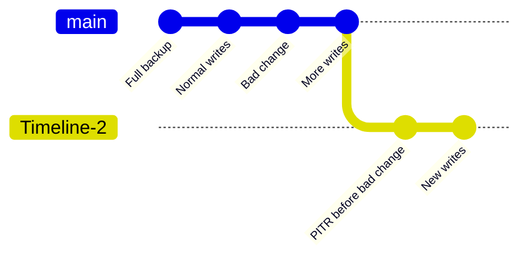

# How PITR Works

> Snapshots, WAL history, recovery windows, recovery targets, and timelines: the five concepts needed to reason accurately about PostgreSQL PITR.

---

LLMS index: [llms.txt](/llms.txt)

---

If a database is a state machine, **WAL** (Write-Ahead Log) is its ordered change history. PostgreSQL records each modification in WAL before applying it to data files. Save a physical snapshot at one point, preserve all later WAL, and PostgreSQL can replay that history to a selected consistent state.

PITR is therefore the combination of three simple elements: a **snapshot** (base backup), **history** (WAL archive), and a **target** (where replay should stop).


----------------

## Snapshot: Base Backup

A **base backup** is a physical snapshot of the whole PostgreSQL cluster and supplies a starting point for recovery. Pigsty uses [**pgBackRest**](https://pgbackrest.org/) to create and manage three backup types:

| Type | Contents | Recovery characteristics |
|:-----|:---------|:-------------------------|
| **Full** | All database-cluster files | Self-contained, shortest chain, largest backup |
| **Differential** | Changes since the latest **full** backup | Restore uses the full plus the differential |
| **Incremental** | Changes since the latest **backup of any type** | Smallest backup, restore depends on its complete chain |
{.full-width}

The wrapper `pg-backup [full|diff|incr]` triggers a backup. With no argument it requests `incr`; pgBackRest creates a full backup instead when no valid full exists. [`pg_crontab`](/docs/pgsql/param/#pg_crontab) declares recurring jobs and installs them in the `postgres` user's crontab.

Backup frequency affects recovery time: the newer the usable backup, the less WAL must be replayed to reach a given target. See [**PITR Tradeoffs**](/docs/concept/pitr/tradeoff/).


----------------

## WAL History

A snapshot reaches only its own state. **WAL archiving** preserves every later change needed to advance beyond it. Pigsty's standard Patroni templates enable archiving and ask PostgreSQL to hand each completed WAL segment to pgBackRest:

```yaml
archive_mode: 'on'
archive_command: 'pgbackrest --stanza=pg-meta archive-push %p'
archive_timeout: 300
```

Two implementation details matter:

* **`archive_timeout: 300`:** on a low-write cluster, PostgreSQL can force a segment switch after five minutes so a partially filled segment does not wait indefinitely. This normally keeps the right edge of the recovery window within minutes when WAL is being generated; it is not a promise that every commit is already remote.
* **Asynchronous archive:** pgBackRest uses `/pg/spool` with `archive-async=y` to batch transfers. Pigsty sets `archive-push-queue-max=4GiB`; if repository failure lets the queue cross that bound, pgBackRest can drop the queued WAL to protect local disk. That creates an archive gap, so a new full backup is required to establish a fresh recoverable chain.

Expiration is automatic. When old backups expire under the repository policy, pgBackRest also expires archived WAL that no remaining backup needs, unless archive retention is overridden explicitly.


----------------

## Recovery Window

The backup and its continuous WAL history form a **recovery window**:

* **Left boundary:** the start of the oldest usable remaining backup chain. In practical time-based descriptions, this is usually summarized by the oldest retained full backup's time.
* **Right boundary:** the latest WAL successfully archived to a repository that survives the incident.

The window moves forward as new backups arrive and old chains expire. Pigsty's `local` preset keeps two full backups; with one successful full per day, coverage is roughly one to two days. The `minio` preset uses `retention_full_type: time` with `retention_full: 14`; with weekly full backups, the oldest retained chain normally yields roughly 14–21 days of steady-state coverage. These are estimates, not SLAs: missed backups, archive gaps, explicit archive-retention overrides, or repository loss change the actual window. Verify it with `pig pb info` and restore drills.

See [**PITR Tradeoffs**](/docs/concept/pitr/tradeoff/) and [**Backup Policy**](/docs/pgsql/backup/policy/).


----------------

## Targets: Where Replay Stops

PostgreSQL supports several ways to locate a state inside the recovery window. Pigsty exposes six target types through [`pg_pitr`](/docs/concept/pitr/restore/):

| `pg_pitr` type | Meaning | Typical use |
|:---------------|:--------|:------------|
| `default` | Replay through all WAL available from the repository | Restore the newest archived state after total loss |
| `time` | Stop at a timestamp | Recover from accidental DML or DDL |
| `xid` | Stop at a transaction ID | Exclude a precisely identified bad transaction |
| `lsn` | Stop at a WAL location | Low-level exact targeting |
| `name` | Stop at a restore point created with `pg_create_restore_point()` | Planned change checkpoint |
| `immediate` | Stop as soon as the selected backup becomes consistent | Validate or expose the selected backup state quickly |
{.full-width}

The `set` field is different: it chooses which backup set pgBackRest restores as the **starting snapshot**; it is not itself a replay stop target.

### Boundary Semantics

Targets are **inclusive** by default: the transaction at the target is retained. To stop immediately **before** a known bad target, set `exclusive: true`, which maps to `recovery_target_inclusive = false`.

Transactions remain atomic. Committed transactions before the effective target survive; transactions not committed at that point are rolled back. Recovery produces a consistent database state rather than half of a transaction.


----------------

## Timelines

Restoring to the past and accepting new writes creates a fork in history. PostgreSQL uses a **timeline** to distinguish each branch. PITR promotion, replica promotion, and failover can all create a new timeline; new WAL does not overwrite the old timeline's files.



Keeping the old history allows another attempt if the first target was wrong. The `timeline` field can select a timeline; Pigsty's recovery declaration defaults to `latest`.

Continue with [**PITR Architecture**](/docs/concept/pitr/arch/) to see how these concepts map to Pigsty components and configuration.
