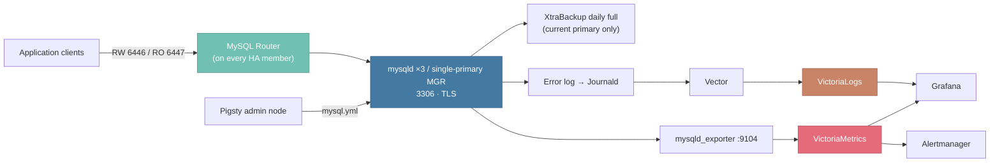

# Module: MYSQL

> Deploy native MySQL 8.4 LTS as a standalone instance or a three-node InnoDB Cluster, with TLS, daily backups, and full observability.

---

LLMS index: [llms.txt](/llms.txt)

---

[MySQL](https://www.mysql.com/) is one of the world's most popular open-source relational databases. Pigsty's **MYSQL** module deploys a fixed, **native MySQL 8.4 LTS platform** on managed nodes: either a standalone instance or a three-node single-primary InnoDB Cluster built on Group Replication, with TLS, backups, monitoring, and lifecycle handled for you.

> [!NOTE] Current status: Pilot module
> MYSQL is a supplementary pilot module. It aims to be a simple, inexpensive, good-enough MySQL cluster — not a peer of the PGSQL module.
> The core capabilities (deployment and convergence, HA failover, daily backups, monitoring and alerting) have been tested systematically;
> destructive procedures such as complete-outage recovery and physical restore are deliberately kept manual, with runbooks provided in [Administration](/docs/mysql/admin).


--------

## Module Capabilities

The MYSQL module currently provides:

- A fixed native MySQL 8.4 LTS platform: server, client, Shell, Router, and XtraBackup at matching versions, working out of the box
- Two topologies: a standalone instance, or a three-node single-primary InnoDB Cluster created and reconciled through MySQL Shell AdminAPI
- MySQL Router on every HA member, providing topology-aware read-write (`6446`) and read-only (`6447`) endpoints
- TLS everywhere: leaf certificates issued from the shared Pigsty CA; non-TLS connections are rejected
- Declarative business objects: `mysql_databases` and `mysql_users` converge additively and never delete data implicitly
- `mysql_parameters` overrides for key settings such as `max_connections`, with orchestrated rolling restarts on configuration change
- A daily full physical backup: XtraBackup backup plus prepare, with retention, concurrency locking, and atomic commit
- Full observability: mysqld_exporter metrics, 68 recording rules, 27 alert rules, 5 Grafana dashboards, and error logs shipped to VictoriaLogs
- `sql_require_primary_key` enabled by default, blocking PK-less tables that would break MGR replication and disaster recovery
- Convergent operations: for a dropped member or drifted AdminAPI state, rerunning `mysql.yml` heals the cluster; destructive paths are fenced by guardrails


--------

## Module Architecture

The MYSQL module depends on [`NODE`](/docs/node) for node management, package repositories, and the shared CA, and on [`INFRA`](/docs/infra) for VictoriaMetrics, VictoriaLogs, Grafana, and Alertmanager. It does not require `ETCD` or `PGSQL`.



In the three-node topology, `mysql_seq=1` is only the bootstrap coordinator. The runtime PRIMARY is elected, and reruns never force the primary back to node 1.


--------

## Components and Ports

| Component | Purpose | Fixed endpoint |
|:---|:---|:---|
| `mysqld` | Standalone server or MGR member | Classic `3306`, X Protocol `33060` |
| Group Replication | Three-member replication and consensus (XCOM) | `33061` |
| MySQL Router | Topology-aware entry point on every HA member | RW `6446`, RO `6447` |
| MySQL Shell | AdminAPI cluster lifecycle | Local control plane |
| XtraBackup | Daily full physical backup | Local backup repository |
| `mysqld_exporter` | Server and MGR metrics | `9104` |
{.full-width}

The role creates and manages three platform identities:

- `dbuser_cluster@'%'`: TLS-only AdminAPI and Router bootstrap identity (created on HA clusters only);
- `dbuser_monitor@'127.0.0.1'`: least-privilege exporter identity;
- `dbuser_backup@'localhost'`: local XtraBackup identity.


--------

## Supported Platforms

The native-package platform gate admits:

| Arch | Supported systems |
|:---|:---|
| `x86_64` | EL 8/9/10, Debian 12/13, Ubuntu 22/24 |
| `aarch64` | EL 9/10 |
{.full-width}

Debian/Ubuntu ARM64 is rejected at preflight: Oracle's APT repository publishes no `arm64` payload for MySQL 8.4. On ARM, use EL 9/10 (e.g. Rocky Linux).


--------

## Scope and Boundaries

MYSQL is a fixed platform, not a general-purpose MySQL installer. The following are **deliberate non-goals** — confirm they are acceptable before adopting:

- **Topology is fixed at 1 or 3 nodes**: no in-place 1→3 upgrade, no 3→5 scale-out, no persistent two-node operation. Capacity upgrades go through logical migration; hardware refresh goes through [same-address replacement](/docs/mysql/admin#replace-a-failed-member)
- **Versions, ports, directories, and charset are fixed**: no parameters expose them. Memory sizing is derived from node specs and can be overridden per key via [`mysql_parameters`](/docs/mysql/param#mysql_parameters)
- **Backups are daily local fulls**: no incremental chain, no continuous binlog archiving, no PITR. Physical restore is a manual procedure with a [runbook](/docs/mysql/admin#restore-from-physical-backup)
- **Complete-outage recovery stays manual** to rule out split-brain from automated guessing; playbook failures print the recovery instructions
- **No VIP / DNS / HAProxy access layer**: clients connect through any member's Router ports, preferably with a multi-host DSN


--------

## Documentation

| Page | Content |
|:---|:---|
| [Configuration](/docs/mysql/config) | Topology planning, identity, databases, users, parameter overrides, backup settings |
| [Parameters](/docs/mysql/param) | The 11 public parameters and fixed platform conventions |
| [Administration](/docs/mysql/admin) | Status checks, client access, config changes, failure handling, and three recovery runbooks |
| [Playbook](/docs/mysql/playbook) | `mysql.yml` and `mysql-rm.yml` usage, tags, and guardrails |
| [Monitoring](/docs/mysql/monitor) | Dashboards, recording rules, alert rules, log queries |
| [Metrics](/docs/mysql/metric) | Label model and the derived-metric dictionary |
| [FAQ](/docs/mysql/faq) | Platform limits, primary-key policy, recovery, troubleshooting |
{.full-width}


--------

## Quick Start

Declare a cluster in the inventory (full template: [`conf/demo/mysql.yml`](https://github.com/pgsty/pigsty/blob/main/conf/demo/mysql.yml)):

```yaml
all:
  children:
    my-test:
      hosts:
        10.10.10.11: { mysql_seq: 1 }
        10.10.10.12: { mysql_seq: 2 }
        10.10.10.13: { mysql_seq: 3 }
      vars:
        mysql_cluster: my-test
        mysql_databases: [ { name: app } ]
        mysql_users: [ { name: app, password: DBUser.App, priv: { 'app.*': 'ALL PRIVILEGES' } } ]

  vars:
    node_repo_modules: node,infra,mysql   # repos must include the mysql module
    mysql_root_password: MySQL.Root       # change all sample passwords in production
    mysql_monitor_password: MySQL.Monitor
    mysql_cluster_password: MySQL.Cluster
```

After [`NODE`](/docs/node) provisioning, deploy:

```bash
./node.yml  -l my-test             # node provisioning: repo, shared CA, monitoring agents
./mysql.yml -l my-test --check     # preflight the complete three-node cluster
./mysql.yml -l my-test             # real run; a three-node cluster takes ~2 minutes

mysql -h 10.10.10.11 -P 6446 -u app -pDBUser.App \
  --ssl-mode=VERIFY_CA --ssl-ca=/etc/pki/ca.crt app   # connect through the Router RW endpoint
```

Then open the Grafana [MySQL Overview](https://demo.pigsty.io/ui/d/mysql-overview) dashboard to inspect the cluster.

---

Section pages:

- [Configuration](/docs/mysql/config/): Plan MySQL topology and identity; declare databases, users, parameter overrides, and backup policy.
- [Parameters](/docs/mysql/param/): The MYSQL module's 13 public parameters: 11 deployment parameters, 2 protected-removal parameters, and fixed platform conventions.
- [Administration](/docs/mysql/admin/): Status checks, client access, configuration changes, failure handling, and the three recovery runbooks for MySQL clusters.
- [Playbook](/docs/mysql/playbook/): Deploy, converge, tune, and retire MySQL clusters with mysql.yml and mysql-rm.yml.
- [Monitoring](/docs/mysql/monitor/): MySQL metric collection, Grafana dashboards, alert rules, and log queries.
- [Metrics](/docs/mysql/metric/): Label model, derived-metric dictionary, and raw metric families of the MYSQL module.
- [FAQ](/docs/mysql/faq/): Frequently asked questions and troubleshooting for the Pigsty MySQL pilot module.
